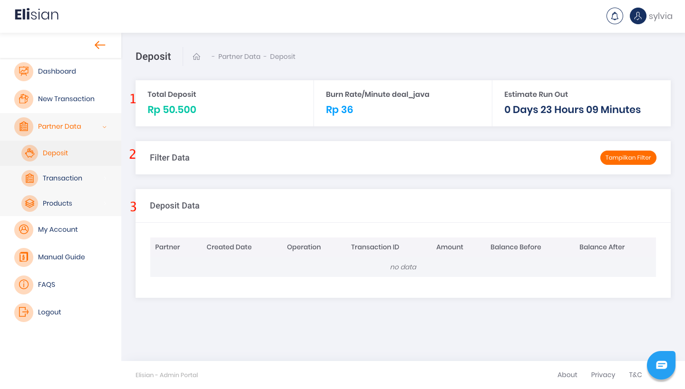
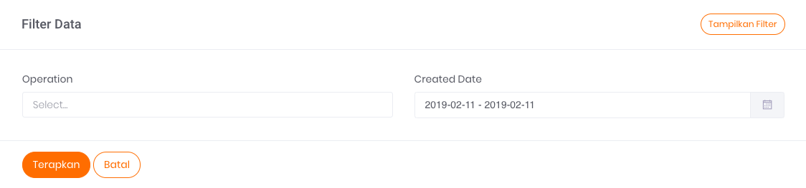
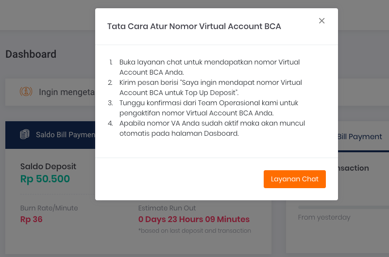
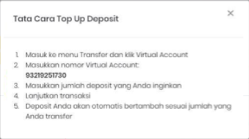

# Deposit
> Fitur Deposit hanya tersedia bagi partner tertentu

Dengan fitur deposit, transaksi Anda akan jadi lebih mudah. Proses pengisian saldo deposit menggunakan Virtual Account sehingga lebih praktis dan cepat. Kami juga menyediakan fitur alert atau notifikasi yang berfungsi untuk memantau sisa saldo deposit Anda.

## Halaman Deposit

> Jika Anda belum terdaftar menggunakan Deposit, silahkan hubungi tim kami melalui email ke helpdesk@sepulsa.com​

Pada halaman ini, Anda akan menemukan Informasi detail terkait deposit Anda. Ada tiga bagian pada laman Deposit, yaitu bagian informasi umum, filter data, dan tabel riwayat deposit

## **Bagian Informasi Umum**

Bagian Informasi umum dapat dilihat pada gambar yang ditandai dengan nomor 1. Informasi yang terdapat pada bagian informasi umum terdiri atas:

- **Total Deposit**  
Berisi jumlah total saldo deposit yang Anda miliki
- **Burn Rate/Minute**  
Merupakan estimasi jumlah pengurangan saldo deposit per menit berdasarkan transaksi yang dilakukan satu jam sebelumnya
- **Estimate** **Run Out**  
Merupakan estimasi atau perkiraan waktu hingga kapan saldo deposit Anda akan habis

## **Bagian Filter Data**  
Bagian filter data deposit dapat dilihat pada gambar yang ditandai dengan nomor 2. Klik tombol Tampilkan Filter untuk menampilkan halaman filter data seperti di bawah ini.

Ada dua kriteria filter data deposit yang dapat dipilih, yaitu:

1. **Operation**

    Merupakan menu berupa select box yang berisi pilihan jenis *event* transaksi terkait deposit Anda. Anda bisa menggunakan filter *operation* untuk menampilkan data untuk jenis *event* tertentu sesuai kebutuhan.

    Terdapat 3 jenis *event* yang dapat dipilih, yaitu:

    1. **Deposit**  
    *Event* deposit artinya adalah Anda melakukan top up deposit yang akan menambahkan jumlah saldo deposit Anda.
    1. **Transaction**  
    *Event transaction* artinya adalah Anda melakukan transaksi pembelian produk yang akan mengurangi jumlah saldo deposit Anda.
    1. **Refund**  
    *Event refund* artinya Pihak sepulsa menambahkan nilai saldo deposit Anda karena transaksi pembelian produk sebelumnya mengalami kegagalan.

2. **Created Date Range**

    Merupakan menu berupa *daterange* *picker* yang dengan *predefined value.* Anda bisa menggunakan filter ini untuk menampilkan data dengan rentang waktu tertentu sesuai kebutuhan.

## **Bagian Riwayat Deposit**

Tabel riwayat deposit adalah bagian utama pada laman Deposit yang berfungsi menampilkan daftar keseluruhan riwayat deposit. 

Berikut ini adalah penjelasan dari isi data yang ada pada tabel.

- **Partner**  
Merupakan nama Instansi Anda
- **Created Date**  
Merupakan tanggal yang menerangkan kapan transaksi dilakukan
- **Operation**  
Merupakan jenis *event* transaksi
- **Transaction ID**  
Merupakan ID Transaksi Anda
- **Amount**  
Merupakan jumlah transaksi terkait
- **Balance Before**  
Merupakan jumlah saldo sebelum transaksi
- **Balance After**  
Merupakan jumlah saldo setelah transaksi

## **Cara Menambah Saldo Deposit**

---

Untuk menambahkan saldo deposit di Elisian Anda, silahkan top up saldo dengan cara transfer ke nomor Virtual Account yang telah dimiliki. Anda dapat melihat tata cara Top Up deposit melalui transfer ke Virtual Account pada laman Dashboard Elisian.

Lakukan *refresh/reload* halaman deposit, pada halaman browser setelah transfer untuk melihat perubahan jumlah deposit.

>Jika belum memiliki Nomor Virtual Account, Anda bisa langsung menghubungi tim operasional / customer service kami.

