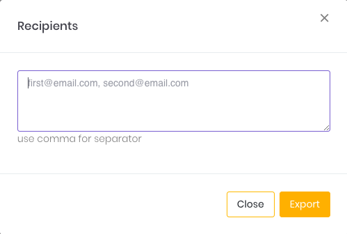

# **Export Data Dengan Format CSV**

> Cara export data Anda menjadi format CSV

Pada beberapa halaman di system Elisian terdapat fitur `export to CSV` yang berfungsi untuk mengekstrak data Anda dari sistem Sepulsa ke dalam bentuk file CSV.

> Data yang tersedia untuk di-export adalah data tiga (3) bulan ke belakang pada bulan berjalan.

## **Export Data**

Anda dapat melakukan export data terkait halaman tertentu untuk kemudian dikirim ke email yang terdaftar.

Berikut cara export data Anda:

1. Klik tombol **Export CSV**. Anda akan mendapati popup seperti pada gambar berikut.

    

    

2. Masukkan email tujuan pengiriman file. Apabila email tujuan lebih dari satu, pisahkan dengan tanda koma (,).
3. Jika tidak diisi, secara default email akun Anda lah yang akan menerima email yang berisi link untuk download CSV
4. Klik tombol **Export** untuk melanjutkan proses.