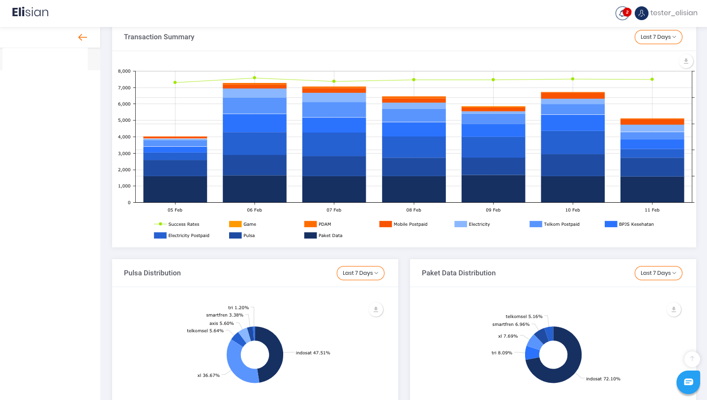
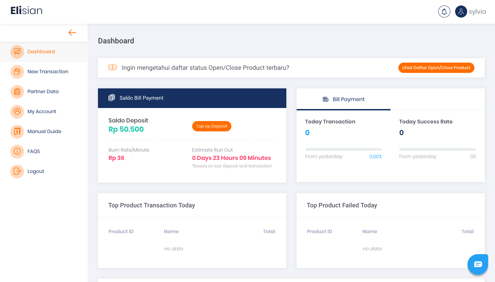

# Fitur Elisian
Penjelasan fitur Elisian

## **Apakah yang bisa Anda lakukan di Elisian?**
Sebagai Partner dari Sepulsa, secara singkat berikut ini adalah empat hal yang bisa Anda lakukan di Elisian:

1. **Melakukan Transaksi satuan (*single)* ataupun secara massal.**  
Anda bisa melakukan transaksi massal dengan cara mengunggah File CSV yang sesuai dengan template yang tersedia.
2. **Melakukan pengecekan transaksi**  
Anda bisa memonitor dan mengunduh data transaksi yang sedang atau telah terjadi dalam waktu yang mendekati *real-time* atau instan.
3. **Melakukan *Top Up* atau pengisian deposit.**  
Anda dapat melakukan *Top Up* atau pengisian deposit dengan melakukan transfer melalui nomor Virtual Account khusus.
4. **Menghubungi Tim *Customer Service*.**  
Apabila memiliki pertanyaan seputar transaksi dan kendala lainnya yang dialami, Anda bisa langsung menghubungi tim *Customer Service* kami melalui Elisian.

## **Penjelasan Fitur**
### **Analytic Dashboard**

Analytic Dashboard adalah fitur yang berisi informasi transaksi yang ditampilkan dalam bentuk grafik (*chart*). Beberapa Informasi yang bisa didapat dan diakses adalah sebagai berikut:

1. Informasi saldo *deposit* bagi partner yang menggunakan sistem *deposit*.
2. Ringkasan (*Summary*) jumlah transaksi yang terjadi pada hari terkait.
3. Pembagian nilai dan jumlah transaksi berdasarkan jenis produk.
4. Daftar produk yang paling banyak terjual pada hari terkait.
5. Transaksi gagal atau *pending* pada hari terkait.

### **Deposit**

Fitur Deposit tersedia bagi partner-partner tertentu yang telah menggunakan sistem deposit. Dengan memiliki deposit,Anda dapat melakukan perencanaan alokasi anggaran untuk setiap Transaksi Anda.

Panduan *top up* atau pengisian saldo deposit, dapat ditemukan pada bagian [**Deposit**](/Business-Initiatives/BPA#Elisian/User-Guide-Elisian/elisian-deposit).

### **Pembelian Pulsa & Paket Data Prabayar**

Anda bisa melakukan transaksi pembelian produk seluler prabayar (*mobile prepaid*) seperti pulsa ataupun paket data, baik dalam bentuk transaksi satuan ataupun dalam jumlah banyak (massal). Transaksi massal bisa dilakukan dengan cara mengunggah file dengan format .CSV ke dalam *platform* Elisian.

Panduan transaksi pembelian pulsa dan paket data seluler dapat ditemukan pada bagian [**Melakukan Transaksi**](/Business-Initiatives/BPA#Elisian/User-Guide-Elisian/elisian-melakukan-trx).

### **Data Produk**

Pada fitur data Produk, Anda bisa melihat daftar produk apa saja yang tersedia untuk transaksi.

Panduan lebih lanjut tentang data dan status produk dapat ditemukan pada bagian [**Status Ketersediaan Produk**](/Business-Initiatives/BPA#Elisian/User-Guide-Elisian/elisian-status-ketersediaan-produk).

### **Data Transaksi**

Fitur data Transaksi merupakan salah satu fitur penting Elisian yang menampilkan data transaksi yang sedang atau telah terjadi pada hari terkait. Fitur ini juga sangat berguna untuk melihat kembali keseluruhan riwayat transaksi apabila ada ketidakcocokan data karena terjadinya kesalahan teknis pada saat transaksi. Pada fitur ini, Anda juga bisa mengunduh data transaksi untuk periode waktu tertentu sesuai kebutuhan.

> Data Transaksi yang tersedia maksimal hanya 3 bulan belakang. Pastikan Anda melakukan backup atau mengunduh data secara berkala sesuai kebutuhan.

Panduan lebih lanjut mengenai data riwayat transaksi dapat ditemukan pada bagian [**Riwayat Transaksi**](/Business-Initiatives/BPA#Elisian/User-Guide-Elisian/elisian-riwayat-transaksi).