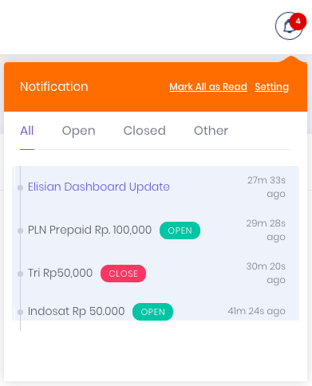
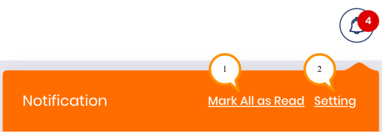
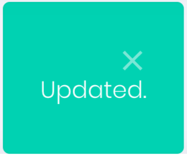

# **Notifikasi**

Fitur notifikasi membantu Anda untuk mendapatkan update terbaru lebih cepat. 

Fitur notifikasi yang ada saat ini  digunakan untuk pemberitahuan status produk mana yang open dan close secara *real-time*. Notifikasi dapat dibuka dengan klik pada simbol lonceng pada pojok kanan atas halaman. 

- Tab All menampilkan semua notifikasi produk dengan semua status
- Tab Open menampilkan notifikasi produk dengan status open
- Tab close menampilkan notifikasi product dengan status close
- Tab Other menampilkan notifikasi berdasarkan custom notif dari elisian.

Terdapat 2 menu pada *Notification*, yaitu:

1. Mark All As Read
2. Setting

## Mark All As Read

Fitur ini digunakan untuk merubah seluruh *Notification* yang belum terbaca menjadi "*Read*".

## Setting

Fitur ini digunakan untuk mengatur apa saja *Notification* yang ingin Anda terima.

1. Centang pada jenis *notification* yang ingin diterima (Anda dapat memilih lebih dari satu jenis)
2. Klik *Save Changes* untuk menyimpan perubahan, atau klik *Cancel* untuk membatalkan perubahan

    

3. Jika perubahan telah tersimpan, akan muncul pemberitahuan *Updated* pada pojok kanan atas halaman.

    

