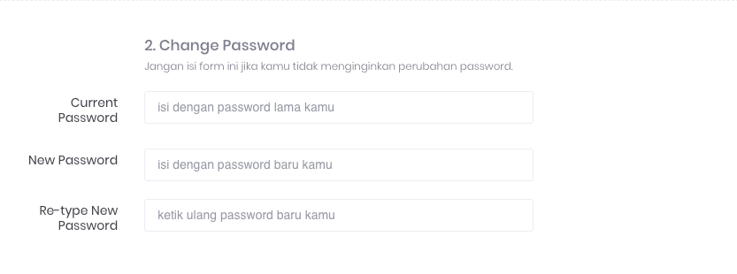
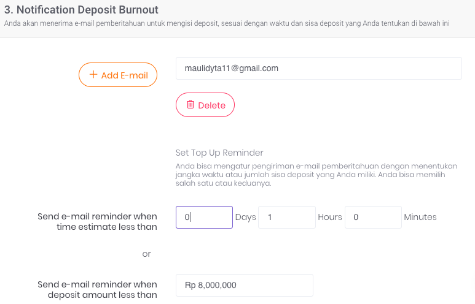

# **Pengaturan Akun**

Pada halaman ini Anda dapat melihat data akun Anda beserta pengaturannya. Ada 3 bagian form yang dapat diisi di antaranya adalah sebagai berikut:

## **Profil**

Bagian profil berisi dua (2) informasi pribadi pengguna, yaitu:

1. **Username**  

    Merupakan username yang Anda gunakan untuk login

2. **Email**  

    Merupakan email yang terkait dengan akun Anda

## **Pengaturan Password**

Bagian pengaturan password berfungsi untuk mengubah password Anda. Terdapat tiga (3) kolom isian, yaitu:

1. **Current Password**  

    Merupakan password Akun Anda saat ini

2. **New Password**  

    Merupakan password baru yang akan Anda gunakan kemudian

3. **Re-type New Password**  

    Merupakan kolom untuk mengkonfirmasi password yang akan Anda gunakan kemudian, isian kolom ini harus sama dengan kolom new-password

## **Pengaturan Notification Deposit Burnout **

Bagian notifikasi atau pemberitahuan *deposit burnout* hanya berlaku bagi partner yang menggunakan sistem deposit.

Pada Bagian pengaturan *deposit* burnout terdapat dua (2) kolom isian, yaitu:

1. **Email Penerima** 

    Merupakan daftar alamat email penerima notifikasi atau pemberitahuan pengingat untuk menambah saldo deposit. Klik pada tombol **add email** untuk menambahkan kolom email baru. Jika tidak diisi, secara default email yang digunakan adalah email akun Elisian Anda.

2. **Batasan waktu burnout** 

    Merupakan durasi perhitungan burn rate penggunan deposit sesuai dengan transaksi yang telah terjadi. 

    Terdapat 2 parameter yang bisa diisi, yaitu:

    - **Waktu**
    Jika diisi maka ketika estimasi deposit kurang dari waktu yang diinputkan, sistem Elisian akan menginisiasi email pengingat yang dikirim ke daftar email penerima.

        Contoh berdasarkan kasus pada Gambar 3 adalah sebagai berikut:
        Batasan waktu adalah 1 hari, maka jika saldo deposit diestimasikan akan habis dalam waktu 1 hari. Sistem Elisian akan mengirimkan email pengingat agar Anda melakukan pengisian saldo.

    - **Jumlah deposit**
    Jika diisi maka ketika saldo deposit Anda di bawah jumlah saldo yang diinputkan, sistem Elisian akan menginisiasi email pengingat yang dikirim ke daftar email penerima.

        Contoh berdasarkan kasus pada Gambar 3 adalah sebagai berikut:
        Batasan jumlah minimal deposit adalah Rp. 8.000.000, maka jika saldo deposit kurang dari Rp. 8.000.000, Sistem Elisian akan mengirimkan email pengingat agar Anda melakukan pengisian saldo.

**Simpan Setting**

Pastikan Anda selalu menyimpan perubahan data yang Anda lakukan, dengan klik tombol **Save Changes**. Jika Anda ingin membatalkan perubahan, klik tombol **Cancel**.