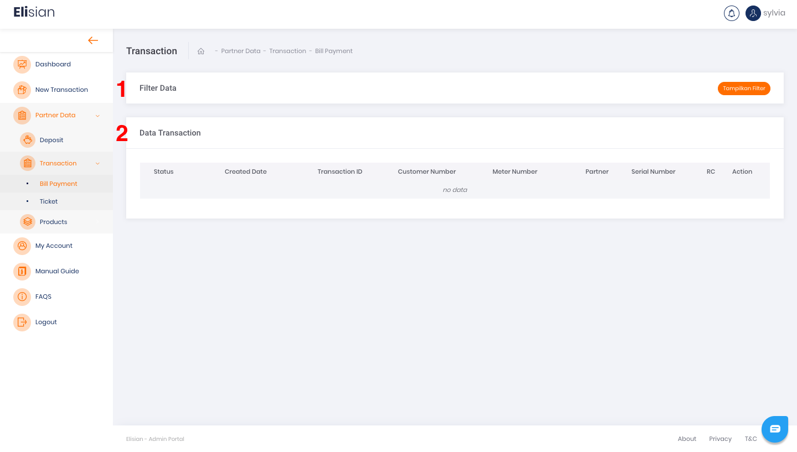
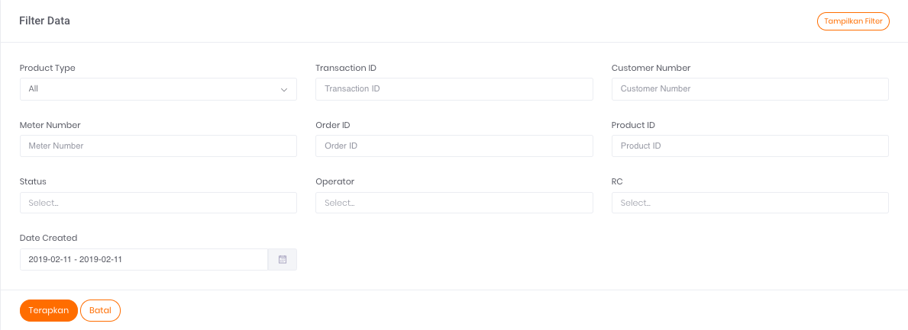

# **Riwayat Transaksi Bill Payment**

> Data Transaksi Bill Payment yang pernah dilakukan sebelumnya:

## **Filter Data**

Fitur ini ditandai dengan nomor 1 pada Gambar 1, berfungsi untuk menyaring data yang akan ditampilkan pada tabel daftar riwayat transaksi Bill Payment. Ada 10 kolom parameter yang dapat Anda gunakan sebagai parameter filter data riwayat transaksi Bill Payment **sesuai kebutuhan, yaitu:

1. **Product Type**  
Merupakan tipe atau jenis produk pada transaksi terkait
2. **Transaction ID**  
Merupakan nomor ID Transaksi terkait
3. **Customer Number**  
Merupakan nomor seluler pelanggan yang digunakan untuk Transaksi
4. **Meter Number**  
Merupakan nomor meter Pelanggan yang terdaftar di PLN. Kolom ini bisa Anda gunakan untuk filter data Transaksi untuk PLN Prabayar maupun Pascabayar
5. **Order ID**  
Merupakan ID Order yang tercatat pada sistem atau pencatatan transaksi Anda
6. **Product ID**  
Merupakan ID Produk dari transaksi terkait
7. **Status**  
Merupakan status transaksi dari produk terkait
8. **Operator**  
Merupakan nama operator transaksi terkait. Misalnya: pada produk Pulsa dan Paket Data, data operator ini akan berisi nama Penyedia layanan komunikasi
9. **RC**  
Merupakan singkatan dari *Response Code* atau kode respon. Jadi, setiap transaksi yang diproses oleh Sepulsa akan memiliki kode respon nya masing-masing.  
Salah satu fungsi kode respon adalah untuk mengidentifikasi status transaksi baik transaksi sukses ataupun gagal
10. **Date Created**  
Merupakan tanggal terjadinya transaksi

## **Export Data**

Anda dapat melakukan export **data **riwayat transaksi Bill Payment yang tersedia dengan rentang waktu maksimum 3 bulan ke belakang. Panduan langkah export data dapat ditemukan pada halaman [**Export data dengan format CSV**](/Business-Initiatives/BPA#Elisian/User-Guide-Elisian/elisian-export-data-format-csv.md).

> Disarankan untuk export data berkala per Quarter (3 Bulan), Untuk data yang lebih dari 3 bulan, silahkan melakukan request ke tim Operation untuk dikirimkan via Email.

## **Tabel Daftar Riwayat Transaksi Bill Payment**

Hasil tangkapan layar tabel ditandai dengan nomor 2 pada Gambar 1 di atas. Tabel ini akan menampilkan data riwayat transaksi Bill Payment **yang pernah terjadi. 

Terdapat 8 informasi yang dapat ditemukan pada tabel:

1. **Status**  
Merupakan status transaksi pada produk terkait
2. **Created Date**  
Merupakan tanggal terjadinya transaksi
3. **Transaction ID**  
Merupakan nomor ID transaksi terkait. ID Transaksi memiliki karakteristik unik, artinya tidak ada ID transaksi yang bernilai sama
4. **Customer Number**  
Merupakan nomor seluler pelanggan yang digunakan untuk transaksi
5. **Meter Number**  
Merupakan nomor meter Pelanggan yang terdaftar di PLN, kolom ini bisa Anda gunakan untuk filter data Transaksi untuk PLN Prabayar maupun Pascabayar
6. **Partner**  
Merupakan nama Instansi yang melakukan transaksi, dalam hal ini nama Instansi Anda
7. **Serial Number**  
Merupakan Nomor serial produk yang digunakan pada Transaksi
8. **RC**  
Merupakan singkatan dari *Response Code* atau kode respon. Jadi, setiap transaksi yang diproses oleh Sepulsa akan memiliki kode responnya masing-masing.  
Salah satu fungsi kode respon adalah untuk mengidentifikasi status transaksi baik transaksi sukses ataupun gagal.
9. **Tombol Action Copy** 
Merupakan tombol yang berfungsi untuk menyalin informasi transaksi ke dalam *clipboard* sistem operasi Anda.