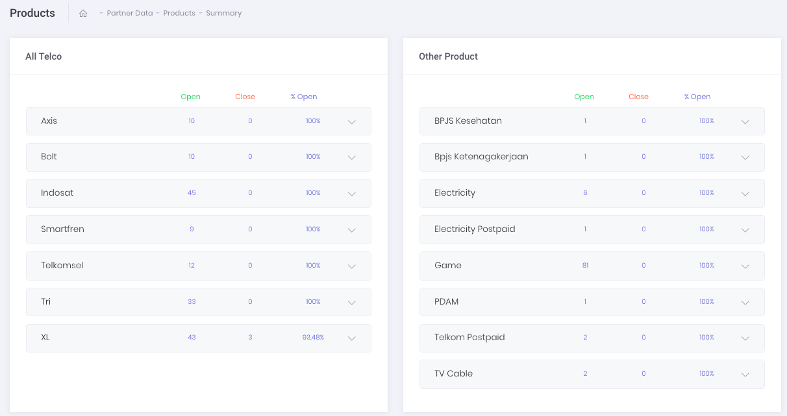
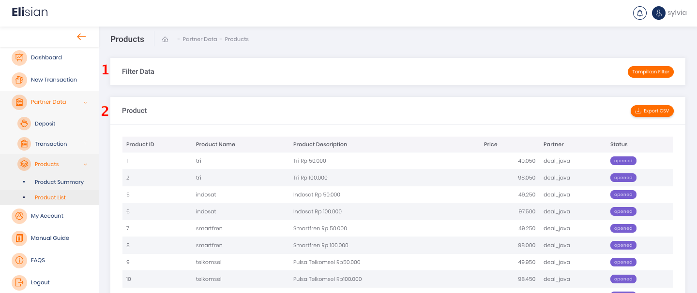
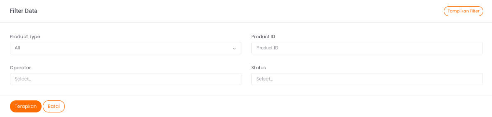
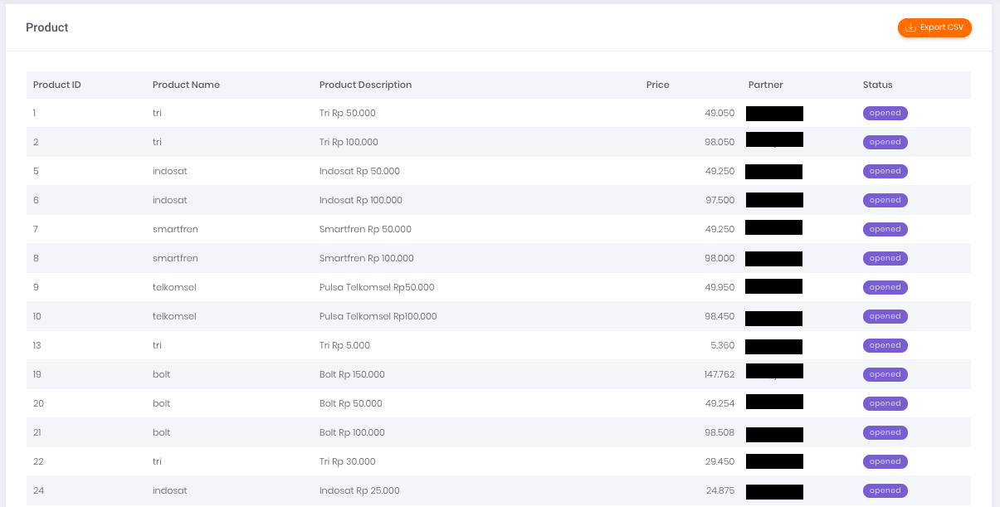

# **Status Ketersediaan Produk**

Menu **Product** pada platform Elisian merupakan halaman yang menampilkan daftar status produk yang tersedia.
> Untuk mendapatkan daftar *product* yang lain dan lebih lengkap, silahkan hubungi kami melalui email ke [angels@sepulsa.com](mailto:angels@sepulsa.com)​

## **Product Summary**

Halaman ini menampilkan ringkasan status daftar produk yang tersedia.

Ada 5 informasi yang bisa Anda dapatkan melalui tabel tersebut, yaitu:

1. **All Telco**  
Produk Telco (pulsa dan paket data)
2. **Other Product**  
Produk di luar Produk Operator Telekomunikasi
3. **Open**  
Menampilkan jumlah produk yang tersedia untuk ditransaksikan oleh partner
4. **Closed**  
Menampilkan jumlah produk yang tidak tersedia untuk dijual dikarenakan oleh berbagai sebab, misalanya gangguan dari sisi operator
5. **% Open**  
Menampilkan persentase jumlah produk yang tersedia (*open*)

## **Product Availability List**

### **Filter Data**

Klik tombol **Tampilkan Filter** untuk menampilkan form filter seperti gambar di bawah ini:

Fitur ini berfungsi untuk melakukan filtrasi data yang akan ditampilkan pada tabel daftar produk yang tersedia bagi Anda*.*

Ada 4 kolom yang dapat diisi pada fitur filter data, yaitu:

1. **Product Type**  
Merupakan tipe atau jenis produk pada transaksi terkait
2. **Product ID**  
Merupakan nomor ID produk terkait
3. **Operator**  
Anda bisa memilih operator produk yang tersedia pada kolom ini
4. **Status**  
Anda bisa memfilter data berdasarkan status produk yang *closed* atau *opened* melalui kolom ini

### **Export CSV**

Anda dapat melakukan export data status terbaru dari produk yang tersedia. Panduan langkah export data dapat ditemukan pada halaman [**Export data dengan format CSV**]().

### **Table Product List**

Tabel ini menampilkan daftar status produk Anda. Informasi yang ditampilkan pada tabel adalah sebagai berikut: 

1. **Product ID**  
Merupakan ID produk terkait
2. **Product Name**  
Merupakan nama atau label produk terkait
3. **Product Description**  
Merupakan deskripsi singkat tentang produk terkait
4. **Price**  
Merupakan harga produk yang Anda dapatkan dari Sepulsa
5. **Partner**  
Merupakan nama instansi Anda
6. **Status**  
Merupakan status dari produk terkait