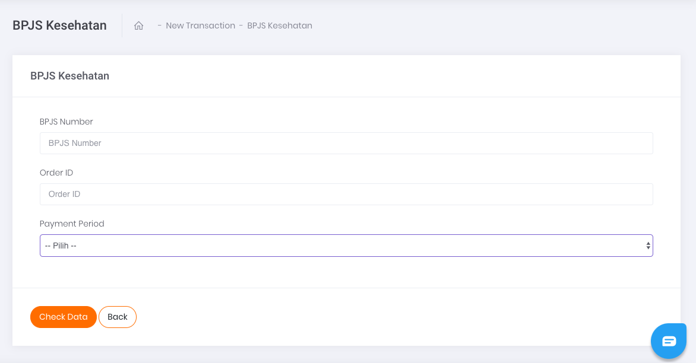

# Single Transaction

Apabila ingin melakukan transaksi satuan pembayaran BPJS Kesehatan, klik pada tombol aksi `Add Single Data` seperti yang tertera pada gambar di bawah.

Gambar 1. Tombol Add Single Data

Setelah klik tombol aksi, akan muncul tampilan laman formulir Single BPJS Kesehatan seperti yang tertera pada gambar berikut.

Gambar 2. Form Single Pembayaran BPJS Kesehatan

Berikut ini adalah langkah-langkah melakukan transaksi:

1. Ketikkan nomor peserta BPJS kesehatan
2. Isi kolom Order ID sesuai dengan Order ID yang tertera di sistem Anda ataupun pencatatan Transaksi Anda
3. Pada kolom *Payment period*, pilih pembayaran BPJS kesehatan untuk berapa bulan kedepan. Misalnya, jika ingin membayar untuk jangka waktu 4 bulan maka pilih *payment* *period* dengan angka 4
4. Kemudian, lanjutkan transaksi dengan melakukan klik tombol Check Data pada bagian kiri bawah halaman.