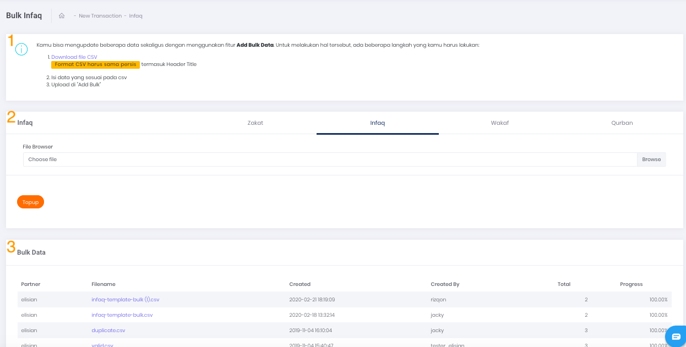
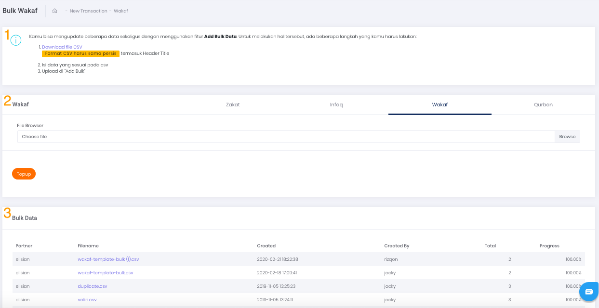
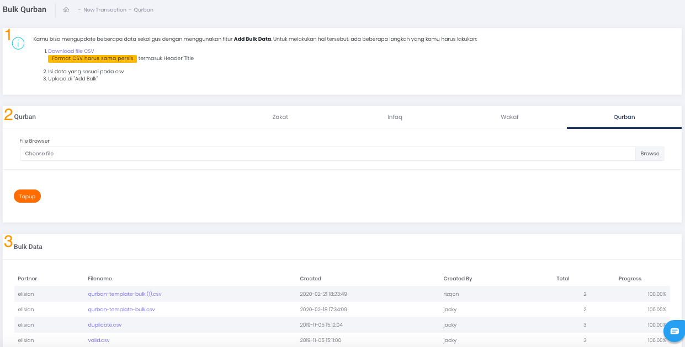

# Bulk Transaction

Apabila ingin melakukan transaksi massal Donation, klik pada tombol aksi `Add Bulk Data` seperti yang tertera pada gambar di bawah.


Gambar 1. Tombol Add Bulk Data

## **Langkah - langkah Melakukan Bulk Transaction**

Berikut ini adalah langkah yang harus Anda lakukan untuk melakukan *Bulk Transaction*:

1. Download template file .csv*,* kemudian isi dengan data transaksi Anda
2. Klik tombol **Browse** dan pilih file yang sudah diisi sebelumnya untuk di-*upload* ke dalam platform Elisian
3. Pilih pada tab jenis donasi yang akan dipilih Zakat,Infaq,Wakaf atau Qurban
4. Kemudian, klik tombol Top Up dan tunggu prosesnya sampai selesai.

## **CSV File Format**

Berikut ini adalah contoh data file .csv beserta data yang akan di-*upload.*

Contoh Data Pada File .csv adalah sebagai berikut:

```
    Customer Number,"Order ID","Product ID"
    0878xxxxxxxxx,"TEST-ORDER-1","1"
    0898xxxxxxxxx,"TEST-ORDER-2","10"
```

## **Penjelasan Halaman Bulk Upload / Transaksi Massal**

Berikut ini adalah penjelasan terkait halaman Bulk Upload/Transaksi Massal:

- **1. Bulk Zakat**

    
    
    Gambar 2. Form bulk/upload/transaksi zakat massal

    Gambar di atas merupakan tampilan halaman Bulk Zakat Upload yang terdiri atas 3 bagian, yaitu:

    1. **Panduan Bulk Transaction**

        Panduan untuk melakukan transaksi dalam jumlah banyak pada satu waktu.

    2. **Add Bulk**

        Pada Add Bulk Zakat yang ditandai dengan nomor 2 pada gambar, terdapat kolom untuk upload csv. Klik pada tombol Browse untuk membuka jendela file upload.

    3. **Tabel riwayat Bulk Data** 

        Tabel ini ditandai dengan nomor 3 pada gambar. Tabel ini menampilkan riwayat proses *bulk upload* yang pernah Anda lakukan sebelumnya.

        Terdapat beberapa informasi pada tabel, yaitu:

        1. **Partner** 

            Merupakan nama Instansi Anda

        2. **Filename** 

            Merupakan nama file yang diupload ketika melakukan *bulk upload*

        3. **Created** 
            Merupakan tanggal *upload* dilakukan

        4. **Created By** 
        
            Merupakan nama User yang melakukan proses *upload*

        5. **Total**

            Total data yang telah di *upload*

        6. **Progress** 

        Merupakan persentase yang menunjukkan proses *upload.*

- **2. Bulk Infaq**

    
   
    Gambar 3. Form bulk/upload/transaksi infaq massal

    Gambar di atas merupakan tampilan halaman Bulk Infaq Upload yang terdiri atas 3 bagian, yaitu:

    1. **Panduan Bulk Transaction**

        Panduan untuk melakukan transaksi dalam jumlah banyak pada satu waktu.

    2. **Add Bulk**

        Pada Add Bulk Infaq yang ditandai dengan nomor 2 pada gambar, terdapat kolom untuk upload csv. Klik pada tombol Browse untuk membuka jendela file upload.

    3. **Tabel Riwayat Bulk Data** 

        Tabel ini ditandai dengan nomor 3 pada gambar. Tabel ini menampilkan riwayat proses *bulk upload* yang pernah Anda lakukan sebelumnya.

        Terdapat beberapa informasi pada tabel, yaitu:

        1. **Partner** 

            Merupakan nama Instansi Anda

        2. **Filename** 

            Merupakan nama file yang diupload ketika melakukan *bulk upload*

        3. **Created** 

            Merupakan tanggal *upload* dilakukan

        4. **Created By** 

            Merupakan nama User yang melakukan proses *upload*

        5. **Total**

            Total data yang telah di *upload*

        6. **Progress** 

            Merupakan persentase yang menunjukkan proses *upload.*

- **3. Bulk Wakaf**

    
    
    Gambar 4. Form bulk/upload/transaksi wakaf massal

    Gambar di atas merupakan tampilan halaman Bulk Wakaf Upload yang terdiri atas 3 bagian, yaitu:

    1. **Panduan Bulk Transaction**

        Panduan untuk melakukan transaksi dalam jumlah banyak pada satu waktu.

    2. **Add Bulk**

        Pada Add Bulk Wakaf yang ditandai dengan nomor 2 pada gambar, terdapat kolom untuk upload csv. Klik pada tombol Browse untuk membuka jendela file upload.

    3. **Tabel Riwayat Bulk Data** 

        Tabel ini ditandai dengan nomor 3 pada gambar. Tabel ini menampilkan riwayat proses *bulk upload* yang pernah Anda lakukan sebelumnya.

        Terdapat beberapa informasi pada tabel, yaitu:

        1. **Partner** 

            Merupakan nama Instansi Anda

        2. **Filename** 

            Merupakan nama file yang diupload ketika melakukan *bulk upload*

        3. **Created** 

            Merupakan tanggal *upload* dilakukan

        4. **Created By** 

            Merupakan nama User yang melakukan proses *upload*

        5. **Total**

            Total data yang telah di *upload*

        6. **Progress** 

            Merupakan persentase yang menunjukkan proses *upload.*

- **4. Bulk Qurban**

    
    
    Gambar 5. Form bulk/upload/transaksi qurban massal

    Gambar di atas merupakan tampilan halaman Bulk Qurban Upload yang terdiri atas 3 bagian, yaitu:

    1. **Panduan Bulk Transaction**

        Panduan untuk melakukan transaksi dalam jumlah banyak pada satu waktu.

    2. **Add Bulk**

        Pada Add Bulk Qurban yang ditandai dengan nomor 2 pada gambar, terdapat kolom untuk upload csv. Klik pada tombol Browse untuk membuka jendela file upload.

    3. **Tabel Riwayat Bulk Data** 

        Tabel ini ditandai dengan nomor 3 pada gambar. Tabel ini menampilkan riwayat proses *bulk upload* yang pernah Anda lakukan sebelumnya.

        Terdapat beberapa informasi pada tabel, yaitu:

        1. **Partner** 

            Merupakan nama Instansi Anda

        2. **Filename** 

            Merupakan nama file yang diupload ketika melakukan *bulk upload*

        3. **Created** 

            Merupakan tanggal *upload* dilakukan

        4. **Created By** 

            Merupakan nama User yang melakukan proses *upload*

        5. **Total**

            Total data yang telah di *upload*

        6. **Progress** 
        
            Merupakan persentase yang menunjukkan proses *upload.*