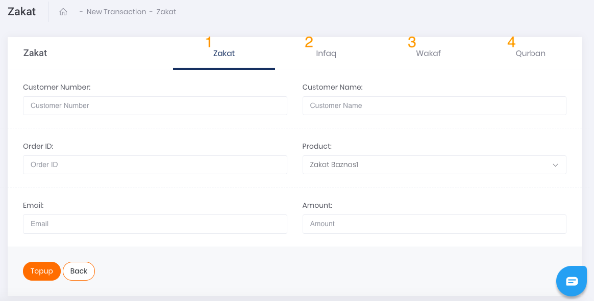
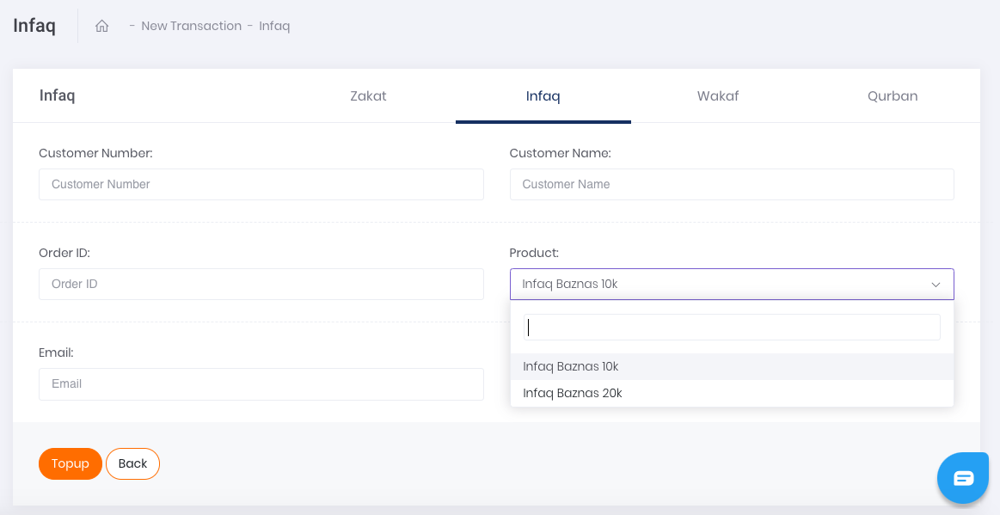
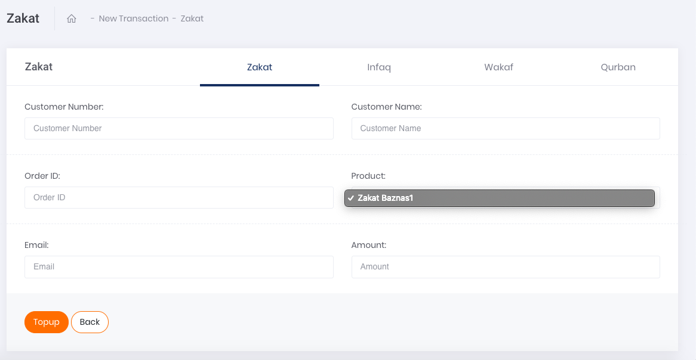
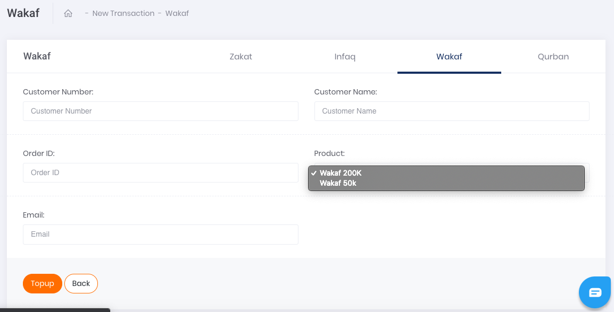
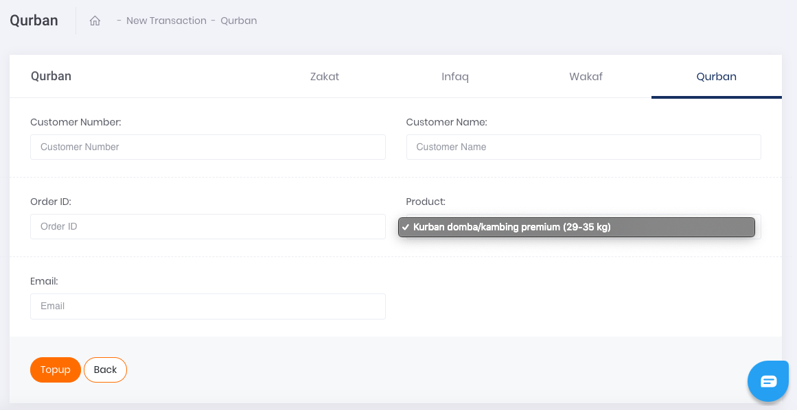

# Single Transaction

Apabila ingin melakukan transaksi satuan Donation, klik pada tombol aksi `Add Single Data` seperti yang tertera pada gambar di bawah.

Gambar 1. Tombol Add Singe Data

Gambar 2. Form Single Donation

**Penjelasan Halaman Singe Transaction**

1. **Single Zakat**

    Setelah klik tombol aksi, akan muncul tampilan laman formulir Donation Zakat seperti yang tertera pada gambar berikut.

    
    
    Gambar 3. Form Single Donation Zakat

    Berikut ini adalah langkah-langkah melakukan transaksi donation zakat:

    1. Ketikkan nomor peserta Donation Zakat di kolom Customer Number.
    2. Isi Kolom nama dengan nama yang diinginkan.
    3. Isi kolom Order ID sesuai dengan Order ID yang tertera di sistem anda ataupun pencatatan Transaksi Anda
    4. Pada kolom *Product* pilih produk sesuai dengan yang diinginkan, hanya satu pilihan yakni Zakat Baznas1. Kemudian pilih Zakat Baznas1.
    5. Isi kolom email dengan email.
    6. Isi kolom amount dengan jumlah uang yang ingin di donasikan.
    7. Kemudian, lanjutkan transaksi dengan melakukan klik tombol Top Up pada bagian kiri bawah halaman.

2. **Single Infaq**

    Setelah klik tombol aksi, dan tekan tab Infaq akan muncul tampilan laman formulir Donation Infaq seperti yang tertera pada gambar berikut.

    
    
    Gambar 4. Form Single Donation Infaq

    Berikut ini adalah langkah-langkah melakukan transaksi:

    1. Ketikkan nomor peserta Donation Infaq di kolom Customer Number.
    2. Isi Kolom nama dengan nama yang diinginkan.
    3. Isi kolom Order ID sesuai dengan Order ID yang tertera di sistem anda ataupun pencatatan Transaksi Anda
    4. Pada kolom *Product* pilih produk sesuai dengan yang diinginkan, ada dua pilihan yakni Infaq Baznas 10k dan Infaq Baznas 20k. Misalnya untuk melanjutkan proses transaksi dapat memilih Infaq Baznas 10k.
    5. Isi kolom email dengan email.
    6. Isi kolom amount dengan jumlah uang yang ingin di donasikan.
    7. Kemudian, lanjutkan transaksi dengan melakukan klik tombol Top Up pada bagian kiri bawah halaman.

3. **Single Wakaf**

    Setelah klik tombol aksi, akan muncul tampilan laman formulir Single Donation Wakaf seperti yang tertera pada gambar berikut.

    
    
    Gambar 5. Form Single Donation Wakaf

    Berikut ini adalah langkah-langkah melakukan transaksi:

    1. Ketikkan nomor peserta Donation Wakaf di kolom Customer Number.
    2. Isi kolom Customer Name dengan nama peserta.
    3. Isi kolom Order ID sesuai dengan Order ID yang tertera di sistem Anda ataupun pencatatan Transaksi Anda
    4. Pada kolom *Product* pilih produk sesuai dengan yang diinginkan, ada dua pilihan yakni Wakaf 200k dan Wakaf 50k. Misalnya untuk melanjutkan proses transaksi dapat memilih Wakaf 50k.
    5. Isi email pada kolom Email.
    6. Kemudian, lanjutkan transaksi dengan melakukan klik tombol Topup pada bagian kiri bawah halaman.

4. **Single Qurban**

    Setelah klik tombol aksi, akan muncul tampilan laman formulir Single Donation Qurban seperti yang tertera pada gambar berikut.

    
    
    Gambar 6. Form Single Donation Qurban

    Berikut ini adalah langkah-langkah melakukan transaksi:

    1. Ketikkan nomor peserta Donation Qurban di kolom Customer Number.
    2. Isi kolom Customer Name dengan nama peserta.
    3. Isi kolom Order ID sesuai dengan Order ID yang tertera di sistem Anda ataupun pencatatan Transaksi Anda
    4. Pada kolom *Product* pilih produk sesuai dengan yang diinginkan, hanya ada satu pilihan yakni Kurban domba/kambing premium (29-35 kg). Kemudian pilih Kurban domba/daging premium (29-35 kg).
    5. Isi email pada kolom Email.
    6. Kemudian, lanjutkan transaksi dengan melakukan klik tombol Topup pada bagian kiri bawah halaman.