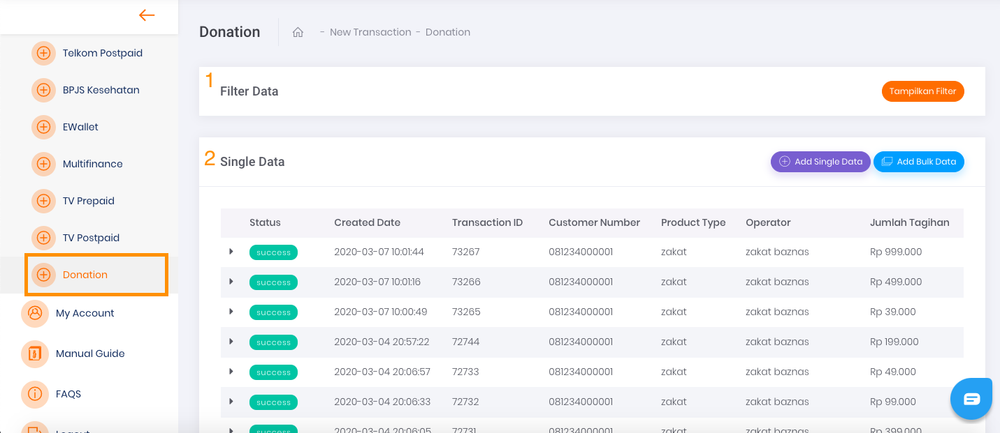
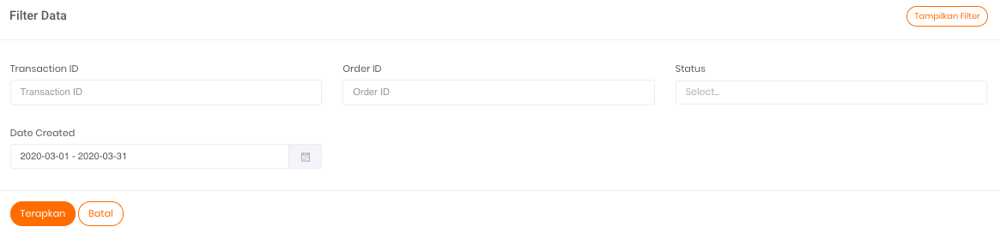
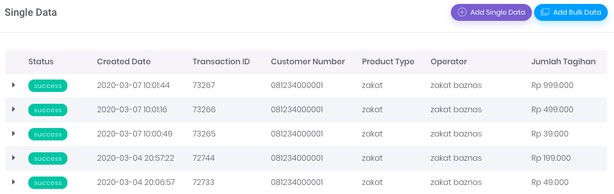

# Transaksi Donation

Transaksi Donation

Anda dapat menggunakan halaman ini untuk melakukan Donation secara manual, baik berupa transaksi satuan ataupun dalam jumlah banyak sekaligus (*bulk*).

Gambar 1. Tampilan Halaman Transaksi Donation

## **Menu Filter Data**

Pada gambar `Tampilan Halaman Transaksi Donation` di atas yang ditandai dengan nomor 1 merupakan menu atau formulir Filter Data. 

Untuk tampilan lebih jelasnya, harap mengacu pada Gambar 2 di bawah ini:

Gambar 2. Tampilan Form Filter Donation

Formulir filter data digunakan untuk menyaring informasi transaksi yang ditampilkan pada tabel daftar riwayat transaksi dengan kriteria tertentu, sesuai dengan isian form filter.

Berikut ini adalah 4 data yang dapat Anda gunakan sebagai parameter untuk mem-filter Transaksi:

1. **Transaction ID** 

    Merupakan nomor transaksi

2. **Order ID** 

    Merupakan nomor order transaksi yang tercatat pada sistem Anda

3. **Status** 

    Merupakan status dari transaksi yang dilakukan

4. **Date Created** 

    Merupakan tanggal ketika transaksi dilakukan

## Tabel Daftar Riwayat Transaksi

Pada gambar `Tampilan Halaman Transaksi Donation` di atas yang ditandai dengan nomor 2 merupakan tabel daftar riwayat transaksi untuk single data. Untuk tampilan lebih jelasnya, harap mengacu pada gambar di bawah ini:

Gambar 3. Tampilan table transaksi Donation 

Tabel tersebut berfungsi untuk menampilkan informasi daftar riwayat transaksi yang pernah Anda lakukan.

**Informasi Tabel** 

Ada 7 informasi yang bisa Anda dapatkan melalui tabel tersebut, yaitu:

1. **Status** 

    Merupakan status dari transaksi yang dilakukan

2. **Created Date**

    Merupakan tanggal ketika transaksi dilakukan

3. **Transaction ID** 

    Merupakan nomor transaksi

4. **Customer Number**

    Merupakan jumlah nomor donasi yang terdaftar.

5. **Product Type**

    Merupakan jenis donasi.

6. **Operator** 

    Merupakan operator donasi yang dituju untuk melakukan transaksi

7. **Jumlah Tagihan**

    Merupakan jumlah tagihan yang dibayarkan kepada operator donasi

## **Tombol Aksi**

Pada Gambar `Tampilan Halaman Transaksi Donation` (poin nomor 2), di bagian kanan, terdapat dua (2) tombol aksi yang berfungsi untuk menjalankan perintah penambahan data transaksi. Penambahan data dapat dilakukan secara *bulk* maupun satuan.

[Single Transaction](/Business-Initiatives/BPA#User-Guide-Elisian/elisian-trx-donation-single)

[Bulk Transaction](/Business-Initiatives/BPA#User-Guide-Elisian/elisian-trx-donation-bulk)