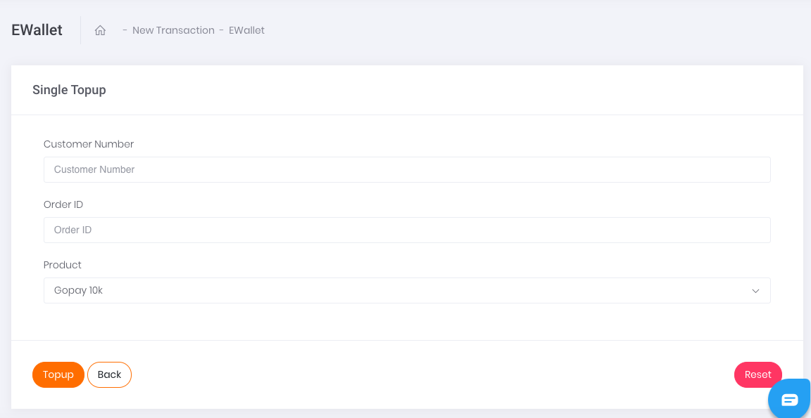

# Single Transaction

Apabila ingin melakukan transaksi satuan E-Wallet, klik pada tombol aksi `Add Single Data` seperti yang tertera pada gambar di bawah.

Gambar 1. Tombol Add Single Data

Setelah klik tombol aksi, akan muncul tampilan laman formulir Single E-Wallet seperti yang tertera pada gambar berikut.

Gambar 2. Form Single E-Wallet

Berikut ini adalah langkah-langkah melakukan transaksi:

1. Ketikkan nomor E-Wallet di kolom Customer Number
2. Isi kolom Order ID sesuai dengan Order ID yang tertera di sistem Anda ataupun pencatatan Transaksi Anda
3. Pada kolom *Product* pilih **Gopay 10k
4. Kemudian, lanjutkan transaksi dengan melakukan klik tombol Topup pada bagian kiri bawah halaman.