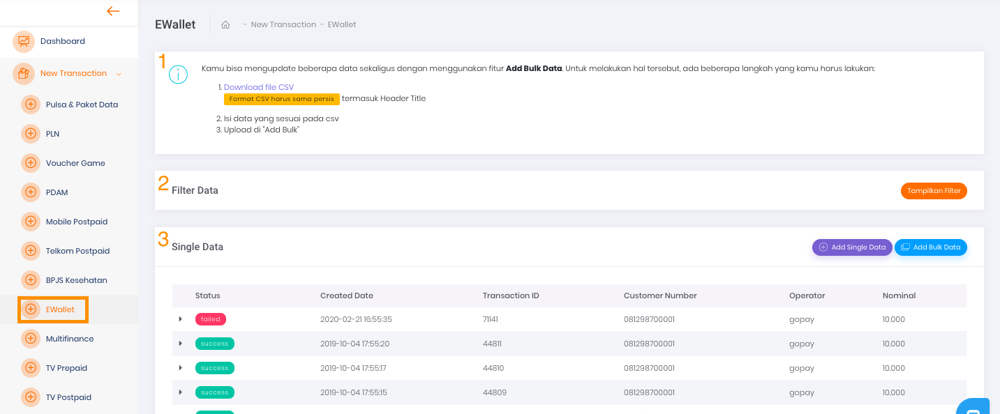
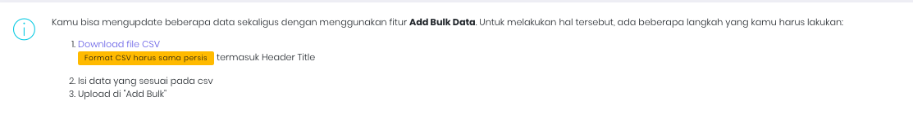
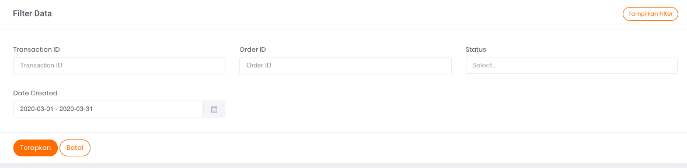
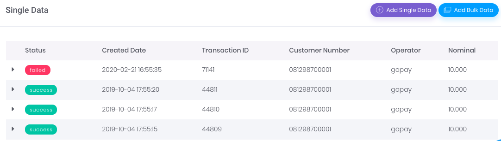

# Transaksi E-Wallet 

Anda dapat menggunakan halaman ini untuk melakukan transaksi E-Wallet secara manual, baik berupa transaksi satuan ataupun dalam jumlah banyak sekaligus (*bulk*).

Gambar 1. Tampilan Halaman Transaksi E-Wallet

## **Panduan untuk melakukan transaksi jumlah banyak dalam satu waktu**

Pada gambar `Tampilan Halaman Transaksi E-Wallet` di atas, bagian yang ditandai dengan nomor 1 adalah panduan untuk melakukan transaksi dalam jumlah banyak dalam satu waktu. Adapun Caranya adalah dengan mengupload atau mengunggah data CSV dengan format yang sudah tersedia dan sudah diisi dengan data transaksi Anda. 

Untuk tampilan lebih jelasnya bisa dilihat pada gambar hasil tangkapan layar di bawah ini

Gambar 2. Tampilan bagian panduan untuk transaksi dalam jumlah banyak dalam satu waktu

## **Menu Filter Data**

Pada gambar `Tampilan Halaman Transaksi E-Wallet` di atas yang ditandai dengan nomor 2 merupakan menu atau formulir Filter Data. 

Untuk tampilan lebih jelasnya, harap mengacu pada Gambar 3 di bawah ini:

Gambar 3. Tampilan Form Filter E-Wallet

Formulir filter data digunakan untuk menyaring informasi transaksi yang ditampilkan pada tabel daftar riwayat transaksi dengan kriteria tertentu, sesuai dengan isian form filter.

Berikut ini adalah 5 data yang dapat Anda gunakan sebagai parameter untuk mem-filter Transaksi:

1. **Transaction ID** 

    Merupakan nomor transaksi

2. **Order ID** 

    Merupakan nomor order transaksi yang tercatat pada sistem Anda

3. **Status** 

    Merupakan status dari transaksi yang dilakukan

4. **Date Created** 

    Merupakan tanggal ketika transaksi dilakukan

## Tabel Daftar Riwayat Transaksi

Pada gambar `Tampilan Halaman Transaksi E-Wallet` di atas yang ditandai dengan nomor 3 merupakan tabel daftar riwayat transaksi untuk single data. Untuk tampilan lebih jelasnya, harap mengacu pada gambar di bawah ini:

Gambar 4. Tampilan table transaksi E-Wallet

Tabel tersebut berfungsi untuk menampilkan informasi daftar riwayat transaksi yang pernah Anda lakukan.

**Informasi Tabel** 

Ada 5 informasi yang bisa Anda dapatkan melalui tabel tersebut, yaitu:

1. **Status** 

    Merupakan status dari transaksi yang dilakukan

2. **Created Date** 

    Merupakan tanggal ketika transaksi dilakukan

3. **Transaction ID** 

    Merupakan nomor transaksi

4. **Customer Number**

    Merupakan jumlah nomor E-Wallet yang terdaftar.

5. **Operator**

    Merupakan operator E-Wallet yang dituju untuk melakukan transaksi.

6. **Nominal**

    Merupakan jumlah nominal yang dibayarkan untuk pengisian E-Wallet.

## **Tombol Aksi**

Pada Gambar `Tampilan Halaman Transaksi E-Wallet` (poin nomor 3), di bagian kanan, terdapat dua (2) tombol aksi yang berfungsi untuk menjalankan perintah penambahan data transaksi. Penambahan data dapat dilakukan secara *bulk* maupun satuan.

[Single Transaction](/Business-Initiatives/BPA#User-Guide-Elisian/elisian-trx-ewallet-single)

[Bulk Transaction](/Business-Initiatives/BPA#User-Guide-Elisian/elisian-trx-ewallet-bulk)