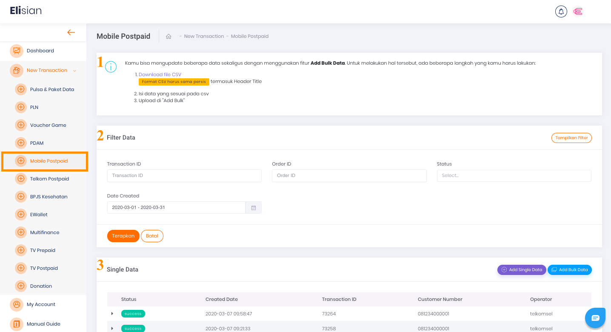
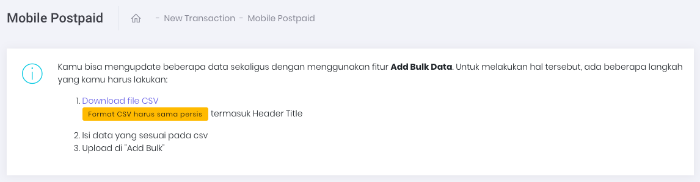
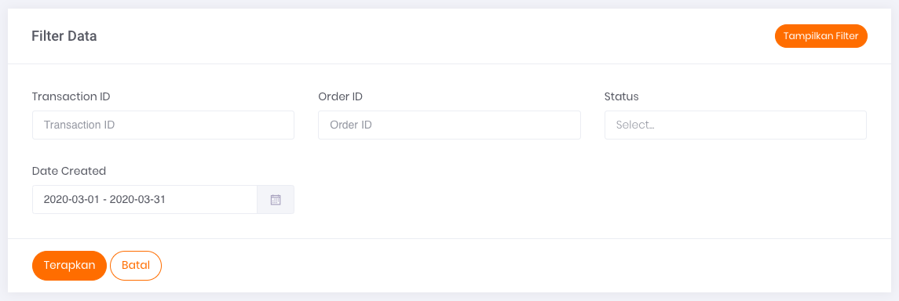
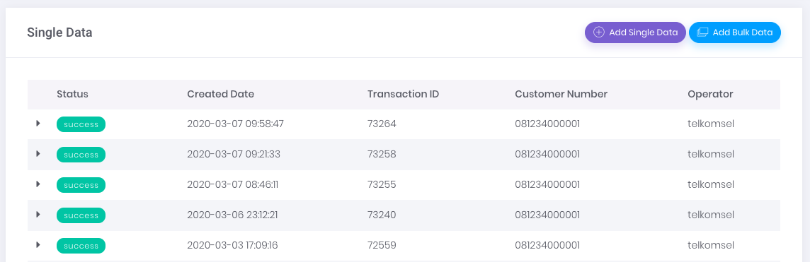

# Transaksi Mobile Postpaid

Anda dapat menggunakan halaman ini untuk melakukan transaksi Mobile Postpaid secara manual, baik berupa transaksi satuan ataupun dalam jumlah banyak sekaligus (bulk).

Gambar 1. Tampilan Halaman Transaksi *Mobile Postpaid*

## **Panduan untuk melakukan transaksi jumlah banyak dalam satu waktu**

Pada gambar `Tampilan Halaman Transaksi Mobile Postpaid` di atas, bagian yang ditandai dengan nomor 1 adalah panduan untuk melakukan transaksi dalam jumlah banyak dalam satu waktu. Adapun Caranya adalah dengan mengupload atau mengunggah data CSV dengan format yang sudah tersedia dan sudah diisi dengan data transaksi Anda. 

Gambar 2. Tampilan bagian panduan untuk transaksi dalam jumlah banyak dalam satu waktu

## **Menu Filter Data**

Pada gambar `Tampilan Halaman Transaksi Mobile Postpaid` di atas yang ditandai dengan nomor 2 merupakan menu atau formulir Filter Data. 

Gambar 3. Tampilan Form Filter Transaksi *Mobile Postpaid* 

Formulir filter data digunakan untuk menyaring informasi transaksi yang ditampilkan pada tabel daftar riwayat transaksi dengan kriteria tertentu, sesuai dengan isian form filter.

Berikut ini adalah 6 data yang dapat Anda gunakan sebagai parameter untuk mem-filter Transaksi:

1. **Transaction ID** 

    Merupakan nomor transaksi

2. **Order ID** 

    Merupakan nomor order transaksi yang tercatat pada sistem Anda

3. **Nominal** 

    Merupakan jumlah nominal transaksi yang dilakukan

4. **Status** 

    Merupakan status dari transaksi yang dilakukan

5. **Date Created** 

    Merupakan tanggal ketika transaksi dilakukan

## Tabel Daftar Riwayat Transaksi

Pada gambar `Tampilan Halaman Transaksi Mobile Postpaid` di atas yang ditandai dengan nomor 3 merupakan tabel daftar riwayat transaksi untuk single data.

Gambar 4. Tampilan Tabel Transaksi *Mobile Postpaid*

Tabel tersebut berfungsi untuk menampilkan informasi daftar riwayat transaksi yang pernah Anda lakukan.

**Informasi Tabel** 

Ada 6 informasi yang bisa Anda dapatkan melalui tabel tersebut, yaitu:

1. **Status** 

    Merupakan status transaksi terkait

2. **Created Date** 

    Merupakan tanggal transaksi terjadi/dilakukan

3. **Transaction ID** 

    Merupakan nomor transaksi yang dilakukan

4. **Customer Number** 

    Merupakan nomor seluler pelanggan yang digunakan sebagai tujuan transaksi

5. **Operator** 

    Merupakan nama operator seluler terkait transaksi yang dilakukan

6. **Nominal** 

    Merupakan nominal transaksi produk ***mobile postpaid***

Pada Gambar `Tampilan Halaman Transaksi Mobile Postpaid` (poin nomor 3), di bagian kanan, terdapat dua (2) tombol aksi yang berfungsi untuk menjalankan perintah penambahan data. Penambahan data dapat dilakukan secara *bulk* maupun satuan.

[Single Transaction](/Business-Initiatives/BPA#User-Guide-Elisian/elisian-trx-mobile-single)

[Bulk Transaction](/Business-Initiatives/BPA#User-Guide-Elisian/elisian-trx-mobile-bulk)