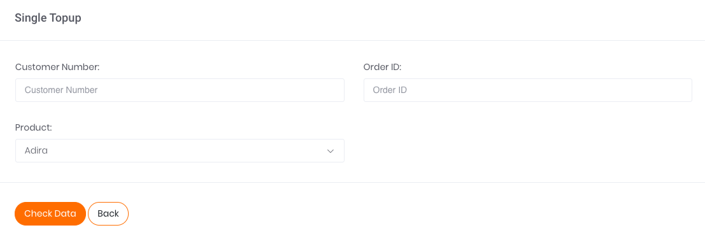

# Single Transaction

Apabila ingin melakukan transaksi satuan Multifinance, klik pada tombol aksi `Add Single Data` seperti yang tertera pada gambar di bawah.

Gambar 1. Tombol Add Single Data

Setelah klik tombol aksi, akan muncul tampilan laman formulir Single Multifinance seperti yang tertera pada gambar berikut.

Gambar 2. Form Single Multifinance

Berikut ini adalah langkah-langkah melakukan transaksi:

1. Ketikkan nomor peserta multifinance di kolom Customer Number.
2. Isi kolom Order ID sesuai dengan Order ID yang tertera di sistem Anda ataupun pencatatan Transaksi Anda
3. Pada kolom *Product* pilih sesuai dengan financing partner yang dituju. Terdapat 10 *financing partner* yakni Adira, Bussan Auto Finance, Mega Auto Finance, Mega Central Finance, Wahana Ottomitra Multiartha, Columbia Finance, Federal International Finance, Mega Finance, MUF_motor dan MUF_mobil jadi pilih salah satu misalnya Adira.
4. Kemudian, lanjutkan transaksi dengan melakukan klik tombol Check Data pada bagian kiri bawah halaman.