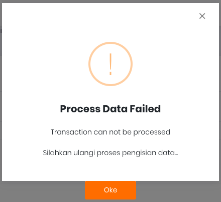

# Single Transaction

Apabila ingin melakukan transaksi satuan PDAM, klik pada tombol aksi `Add Single Data` seperti yang tertera pada gambar di bawah.

Gambar 1. Tombol Add Single Data

Setelah klik tombol aksi, akan muncul tampilan laman formulir *Single Top Up* seperti yang tertera pada gambar berikut. 

Gambar 2. Formulir Add Single Data

Berikut ini adalah langkah-langkah melakukan transaksi:

1. Masukkan nomor pelanggan PDAM pada kolom ***Customer Number***
2. Isi kolom ***Order ID*** sesuai dengan Order ID yang tertera di sistem ataupun pencatatan Transaksi.
3. Pada kolom ***Area***, klik pada *select-box* yang tersedia. Pilih sesuai dengan area PDAM anda.
4. Kemudian, lanjutkan transaksi dengan melakukan klik tombol ***Check Data.***
5. Jika data yang dimasukkan benar maka klik tombol ***Topup*** pada bagian kiri bawah halaman.
6. Jika data yang dimasukkan salah maka akan muncul pemberitahuan ***Process Data Failed***.

Gambar 3. Peringatan Kesalahan Add Single Data