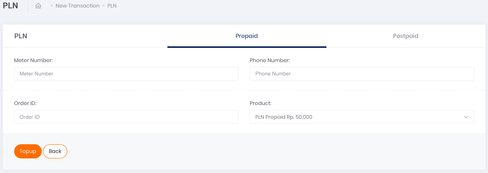
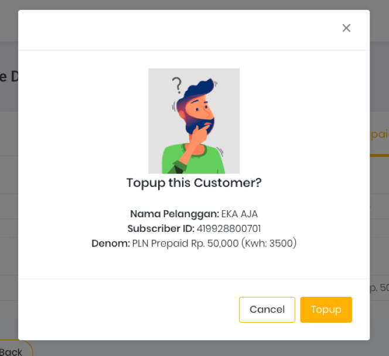
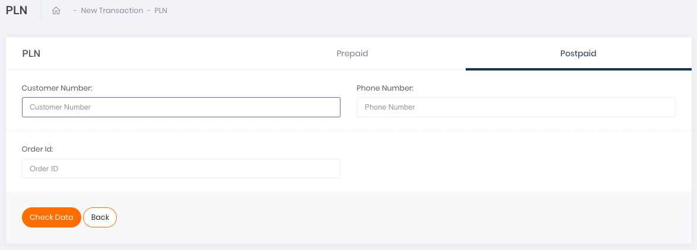
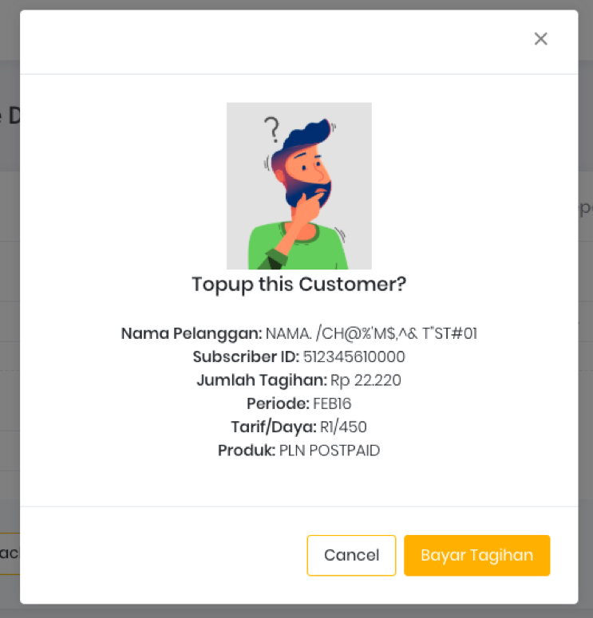

# Single Transaction

Apabila ingin melakukan transaksi baru PLN, klik pada tombol aksi "**Add Single Data**". Terdapat dua (2) jenis transaksi PLN yang dapat dilakukan, yaitu PLN Prabayar dan PLN Pascabayar.

Gambar 1. Tombol Add Single Data

Setelah klik tombol aksi, akan muncul tampilan laman formulir *Single Top Up* seperti yang tertera pada gambar berikut. 

- **PLN Prabayar (Prepaid)**

    
    
    Gambar 2. Tampilan Form untuk Transaksi Single PLN Prepaid

    Setelah klik tombol **Add Single Data**, akan muncul tampilan laman formulir transaksi prabayar (prepaid) seperti yang tertera pada gambar di atas. Berikut ini adalah langkah-langkah transaksinya:

    1. Ketikkan nomor meter pelanggan yang akan ditransaksikan pada kolom Meter Number
    2. Selanjutnya, isi kolom Phone Number dengan nomor seluler pelanggan yang akan menerima token listrik
    3. Isi kolom Order ID sesuai dengan Order ID yang tertera di sistem Anda ataupun pencatatan Transaksi Anda
    4. Pada kolom Product, klik pada *select-box* yang tersedia. Akan muncul pilihan nominal PLN prabayar yang dapat digunakan
    5. Kemudian, lanjutkan transaksi dengan melakukan klik tombol Check Data pada bagian kiri bawah halaman
    6. Anda akan mendapati *pop-up* konfirmasi transaksi seperti pada gambar di bawah, klik tombol Topup untuk melanjutkan transaksi.

        
        
        Gambar 3. Tampilan *pop-up* konfirmasi pembayaran PLN Prabayar

- **PLN Pascabayar**

     
    
    Gambar 4. Tampilan Form untuk Transaksi Single PLN Postpaid

    Setelah klik tombol **Add Single Data** dan muncul tampilan laman formulir, pilih tab Postpaid untuk melakukan transaksi pascabayar seperti yang tertera pada gambar di atas. Berikut ini adalah langkah-langkah transaksinya:

    1. Ketikkan nomor ID pelanggan yang akan ditransaksikan pada kolom Customer Number
    2. Selanjutnya, isi kolom Phone Number dengan nomor seluler pelanggan terdaftar
    3. Isi kolom Order ID sesuai dengan Order ID yang tertera di sistem Anda ataupun pencatatan Transaksi Anda
    4. Kemudian, lanjutkan transaksi dengan melakukan klik tombol Check Data pada bagian kiri bawah halaman
    5. Anda akan mendapati *pop-up* konfirmasi transaksi seperti pada gambar di bawah, klik tombol Topup untuk melanjutkan transaksi.

         
        
        Gambar 5. Tampilan *pop-up* konfirmasi pembayaran PLN Pascabayar