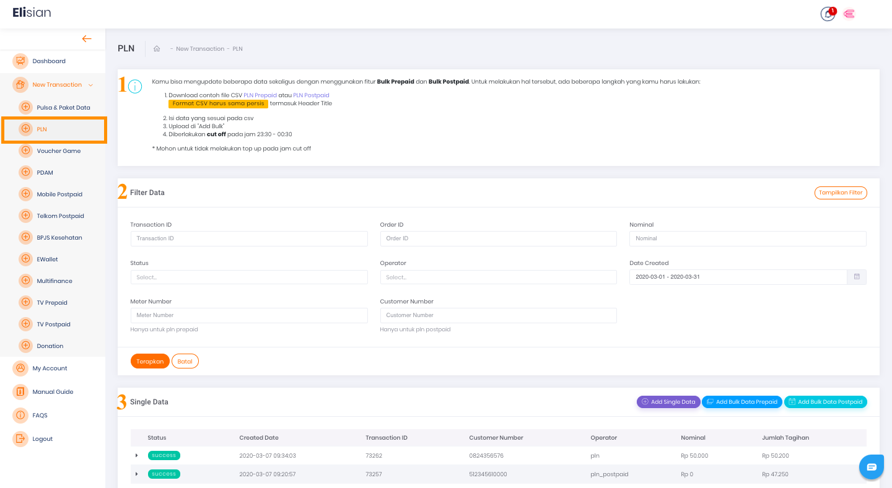
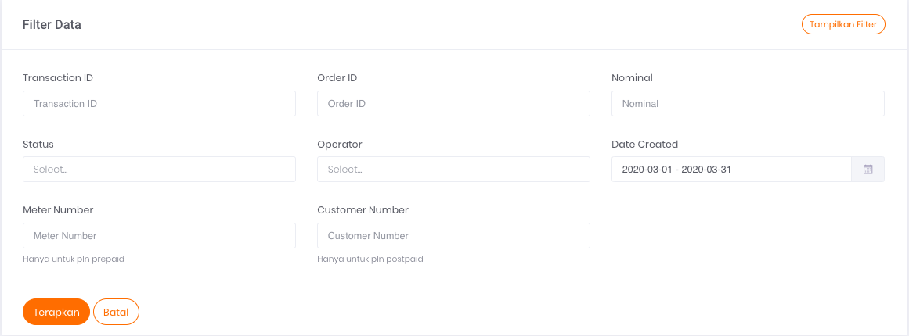
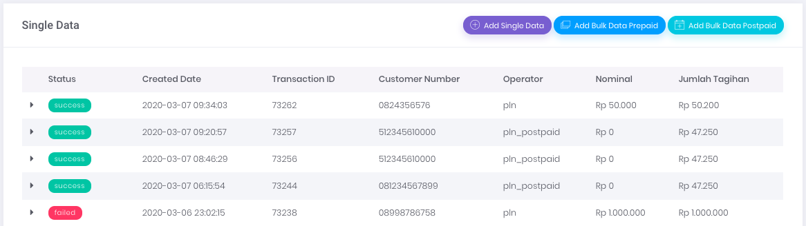

# Transaksi PLN 

Anda dapat menggunakan halaman ini untuk melakukan transaksi pembayaran PLN prabayar dan PLN pascabayar.

Gambar 1. Tampilan Halaman Transaksi PLN

## **Menu Filter Data**

Pada gambar `Tampilan Halaman Transaksi PLN` di atas pada nomor 2, terdapat formulir Filter Data. Untuk detil isi formulir filter, harap mengacu pada gambar di bawah ini.

Gambar 2. Tampilan Form Filter Data

Formulir filter data digunakan untuk menyaring informasi transaksi PLN yang ditampilkan pada tabel daftar riwayat transaksi PLN dengan kriteria tertentu, sesuai dengan isian form filter.

Berikut ini adalah 8 data yang dapat Anda gunakan sebagai parameter untuk mem-filter Transaksi:

1. **Transaction ID** 

    Merupakan nomor transaksi

2. **Order ID** 

    Merupakan nomor order transaksi yang tercatat pada sistem Anda

3. **Nominal** 

    Merupakan jumlah nominal transaksi yang dilakukan

4. **Status** 

    Merupakan status dari transaksi yang dilakukan

5. **Operator** 

    Pilih salah satu jenis PLN yang digunakan, *Postpaid* atau PLN.

6. **Date Created** 

    Merupakan tanggal ketika transaksi dilakukan

7. **Meter Number** 

    Digunakan untuk **PLN prabayar** saja, merupakan nomor pelanggan yang terdaftar di PLN dan digunakan untuk transaksi

8. **Customer Number** 

    Pada transaksi **PLN Prabayar** kolom ini diisi dengan nomor ponsel pelanggan yang melakukan transaksi. Pada transaksi **PLN Pascabayar** kolom ini merupakan nomor pelanggan pascabayar yang terdaftar di PLN

## **Tabel Daftar Riwayat Transaksi PLN**

Pada gambar di atas yang ditandai dengan nomor 3 merupakan tabel daftar riwayat transaksi untuk single data. Untuk tampilan lebih jelasnya, harap mengacu pada gambar 3 di bawah ini:

Gambar 3. Tampilan Daftar Riwayat Transaksi PLN

Tabel ini berfungsi untuk menampilkan informasi daftar riwayat transaksi PLN yang pernah Anda lakukan di Elisian.

## **Informasi Tabel**

Ada 7 informasi yang bisa Anda dapatkan melalui tabel tersebut, yaitu:

1. **Status** 

    Merupakan status transaksi terkait

2. **Created Date** 

    Merupakan tanggal transaksi dibuat (dilakukan)

3. **Transaction ID** 

    Merupakan nomor transaksi yang dilakukan

4. **Customer Number** 

    Untuk transaksi PLN Prabayar merupakan nomor seluler pelanggan yang digunakan sebagai tujuan transaksi. Untuk transaksi PLN Pascabayar merupakan nomor pelanggan yang terdaftar di PLN

5. **Operator** 

    Merupakan label jenis transaksi PLN yang dilakukan

6. **Nominal** 

    Merupakan nominal transaksi terkait

7. **Jumlah Tagihan** 

    Merupakan harga jual/nominal yang dibayarkan dari transaksi terkait

## **Tombol Aksi**

Pada Gambar `Tampilan Halaman Transaksi PLN` (poin nomor 3), di bagian kanan, terdapat tiga (3) tombol aksi yang berfungsi untuk menjalankan perintah penambahan data. Penambahan data dapat dilakukan secara *bulk* maupun satuan.

[Single Transaction ](/Business-Initiatives/BPA#User-Guide-Elisian/elisian-trx-pln-single)

[Bulk Transaction Data Prepaid](/Business-Initiatives/BPA#User-Guide-Elisian/elisian-trx-pln-bulk-prepaid)

[Bulk Transaction Data Postpaid](/Business-Initiatives/BPA#User-Guide-Elisian/elisian-trx-pln-bulk-postpaid)