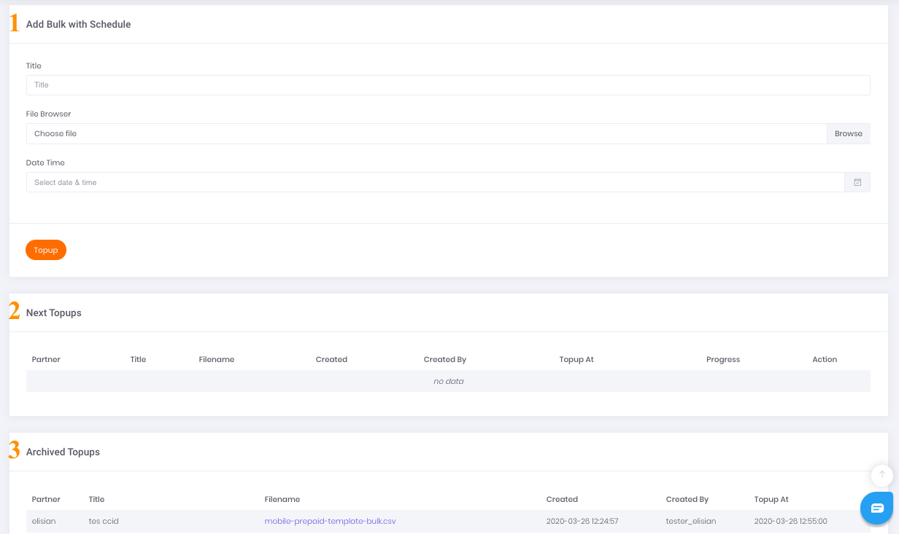

# Bulk With Schedule

*Action* atau bentuk transaksi ini hampir sama dengan Bulk Transaction sebelumnya. Hal yang membedakan adalah bentuk transaksi akan dilakukan pada jam tertentu yang sudah dijadwalkan dan diatur sebelumnya. 

Untuk memulai sesi transaksi tekan tombol seperti gambar dibawah ini:

Gambar 1. tombol aksi bulk transaction yang disertai penjadwalan

## **Langkah-langkah melakukan *bulk transaction* yang disertai dengan penjadwalan**

Gambar 2. Form bulk transaction yang disertai penjadwalan

1. ***Add Bulk With Schedule*** 

    Form penambahan data transaksi yang akan disesuaikan jadwalnya.

    Berikut ini adalah langkah-langkah yang harus dilakukan untuk melakukan ***bulk transaction*** yang disertai penjadwalan pemrosesannya.

    1. Download template file .csv*,* kemudian isi dengan data Transaksi Anda
    2. Masukkan judul file yang akan diunggah
    3. Klik tombol browse dan pilih file yang sudah diisi sebelumnya untuk kemudian di-*upload* ke platform Elisian
    4. Tetapkan waktu pemrosesan yang diinginkan dengan cara memilih tanggal dan juga waktu pada kolom Date Time yang sudah tersedia
    5. Kemudian, lanjutkan dengan meng-klik tombol Topup dan tunggu prosesnya sampai selesai.
2. ***Next Topups***

    Tabel yang menampilkan data ***bulk transaction*** sesuai penjadwalan.

3. ***Arcived Topups***

    Tabel yang menampilkan data ***bulk transaction*** yang telah di batalkan sehingga berstatus ***Archived***