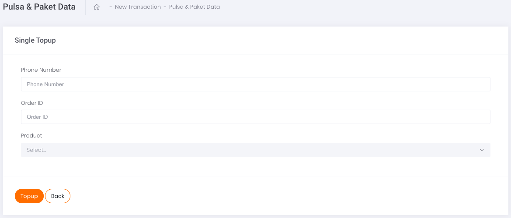

# Single Transaction

Apabila ingin melakukan transaksi satuan pulsa dan paket data, klik pada tombol aksi `Add Single Data` seperti yang tertera pada gambar di bawah.

Gambar 1. Tombol Add Single Data

Setelah klik tombol aksi, akan muncul tampilan laman formulir Single Top Up seperti yang tertera pada gambar berikut. 

Gambar 2. Form Single Top Up

Berikut ini adalah langkah-langkah melakukan transaksi:

1. Ketikkan nomor tujuan transaksi pada kolom Phone Number
2. Isi kolom Order ID sesuai dengan Order ID yang tertera di sistem Anda ataupun pencatatan Transaksi Anda
3. Pada kolom Product, klik pada *select-box* yang tersedia. Produk yang muncul akan disesuaikan dengan kode prefix nomor seluler tujuan / phone number yang Anda gunakan di langkah pertama. 

    Misalnya: 

    0813 : kode prefix nomor seluler Telkomsel 

    0857 : kode prefix nomor seluler Indosat

4. Kemudian, lanjutkan transaksi dengan melakukan klik tombol Topup pada bagian kiri bawah halaman.