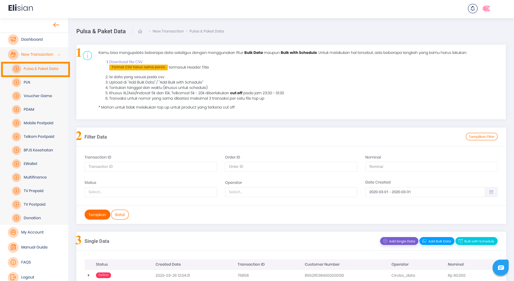
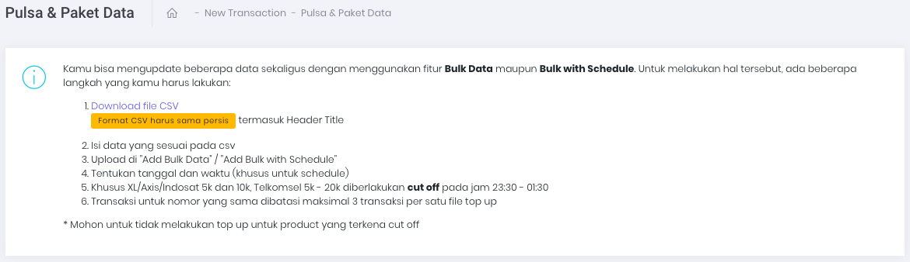
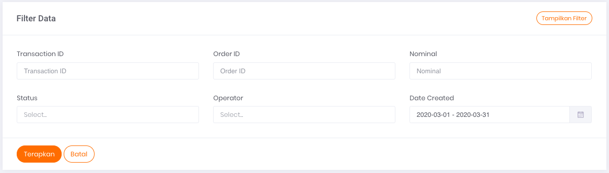

# Transaksi Pembelian Pulsa dan Paket Data

Anda dapat menggunakan halaman ini untuk melakukan transaksi **Pulsa dan Paket Data** secara manual, baik berupa transaksi satuan ataupun dalam jumlah banyak sekaligus *(bulk)*.

Gambar 1. Tampilan halaman transaksi pulsa dan paket data

## **Panduan untuk melakukan transaksi jumlah banyak dalam satu waktu**

Pada gambar `Tampilan Halaman Transaksi Pulsa dan Paket Data` di atas, bagian yang ditandai dengan nomor 1 adalah panduan untuk melakukan transaksi dalam jumlah banyak dalam satu waktu. Adapun caranya adalah dengan  mengunggah data CSV dengan format yang sudah tersedia dan sudah diisi dengan data transaksi Anda. 

Untuk tampilan lebih jelasnya bisa dilihat pada gambar hasil tangkapan layar di bawah ini:

Gambar 2. Tampilan bagian panduan untuk transaksi dalam jumlah banyak dalam satu waktu

## **Menu Filter Data**

Pada gambar `Tampilan Halaman Transaksi Pulsa dan Paket Data` di atas yang ditandai dengan nomor 2 merupakan menu atau formulir Filter Data. 

Untuk tampilan lebih jelasnya, harap mengacu pada Gambar 3 di bawah ini:

Gambar 3. Tampilan Form Filter Pulsa dan Pake Data

Formulir filter data digunakan untuk menyaring informasi transaksi yang ditampilkan pada tabel daftar riwayat transaksi dengan kriteria tertentu, sesuai dengan isian form filter.

Berikut ini adalah 6 data yang dapat Anda gunakan sebagai parameter untuk mem-filter Transaksi:

1. **Transaction ID** 

    Merupakan nomor transaksi

2. **Order ID** 

    Merupakan nomor order transaksi yang tercatat pada sistem Anda

3. **Nominal** 

    Merupakan jumlah nominal transaksi yang dilakukan

4. **Status** 

    Merupakan status dari transaksi yang dilakukan

5. **Operator** 

    Merupakan nama operator seluler terkait dengan transaksi yang dilakukan

6. **Date Created** 

    Merupakan tanggal ketika transaksi dilakukan

## Tabel Daftar Riwayat Transaksi

Pada gambar `Tampilan Halaman Transaksi Pulsa dan Paket Data` di atas yang ditandai dengan nomor 3 merupakan tabel daftar riwayat transaksi untuk single data. Untuk tampilan lebih jelasnya, harap mengacu pada gambar di bawah ini:

Gambar 4. Tampilan tabel transaksi Pulsa dan Paket Data

Tabel tersebut berfungsi untuk menampilkan informasi daftar riwayat transaksi yang pernah Anda lakukan.

**Informasi Tabel** 

Ada 6 informasi yang bisa Anda dapatkan melalui tabel tersebut, yaitu:

1. **Status** 

    Merupakan status transaksi terkait

2. **Created Date** 

    Merupakan tanggal transaksi terjadi/dilakukan

3. **Transaction ID** 

    Merupakan nomor transaksi yang dilakukan

4. **Customer Number** 

    Merupakan nomor seluler pelanggan yang digunakan sebagai tujuan transaksi

5. **Operator** 

    Merupakan nama operator seluler terkait transaksi yang dilakukan

6. **Nominal** 

    Merupakan nominal transaksi produk pulsa atau paket data

## **Tombol Aksi**

Pada Gambar 1 (poin nomor 3), di bagian kanan, terdapat tiga (3) tombol aksi yang berfungsi untuk menjalankan perintah Top Up atau transaksi. Panduan Transaksi Pulsa & Paket Data dibagi menjadi beberapa bagian berdasarkan caranya.

[Single Transaction ](/Business-Initiatives/BPA#User-Guide-Elisian/elisian-trx-pulsa-paketdata-single)

[Bulk Transaction Data Prepaid](/Business-Initiatives/BPA#User-Guide-Elisian/elisian-trx-pulsa-paketdata-bulk)

[Bulk Transaction Data Postpaid](/Business-Initiatives/BPA#User-Guide-Elisian/elisian-trx-pulsa-paketdata-bulk-schedule)