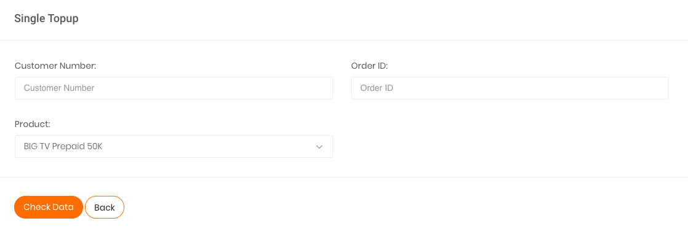

# Single Transaction

Apabila ingin melakukan transaksi satuan TV Prepaid, klik pada tombol aksi `Add Single Data` seperti yang tertera pada gambar di bawah.

Gambar 1. Tombol Add Single Data

Setelah klik tombol aksi, akan muncul tampilan laman formulir Single BPJS Kesehatan seperti yang tertera pada gambar berikut.

Gambar 2. Form Single TV Prepaid

Berikut ini adalah langkah-langkah melakukan transaksi:

1. Ketikkan nomor peserta TV Prepaid di kolom Customer Number.
2. Isi kolom Order ID sesuai dengan Order ID yang tertera di sistem Anda ataupun pencatatan Transaksi Anda
3. Pada kolom *Product* pilih produk sesuai dengan yang diinginkan, ada dua pilihan yakni BIG TV Prepaid 50k dan BIG TV Prepaid 100k. Misalnya pilih BIG TV prepaid 50k
4. Kemudian, lanjutkan transaksi dengan melakukan klik tombol Check Data pada bagian kiri bawah halaman.