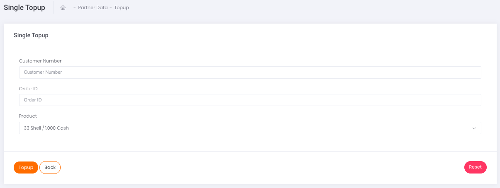

# Single Transaction

Apabila ingin melakukan transaksi satuan ***Voucher Game***, klik pada tombol aksi `Add Single Data` seperti yang tertera pada gambar di bawah.

Gambar 1. Tombol Add Single Data

Setelah klik tombol aksi, akan muncul tampilan laman formulir *Single Top Up* seperti yang tertera pada gambar berikut. 

Gambar 2. Form untuk menambahkan transaksi Voucher Game

Setelah klik tombol **Add Single Data**, akan muncul tampilan laman formulir transaksi voucher game seperti yang tertera pada gambar di atas. Berikut ini adalah langkah-langkah transaksinya.

1. Ketikkan nomor seluler pelanggan pada kolom Customer Number
2. Isi kolom Order ID sesuai dengan Order ID yang tertera di sistem Anda ataupun pencatatan Transaksi Anda
3. Pada kolom Product , klik pada *select-box* yang tersedia. Akan muncul pilihan produk voucher game yang dapat digunakan
4. Kemudian, lanjutkan transaksi dengan melakukan klik tombol Topup pada bagian kiri bawah halaman
5. Apabila transaksi Anda berhasil disimpan, Anda akan mendapati tulisan 'success' seperti pada gambar di bawah ini:

