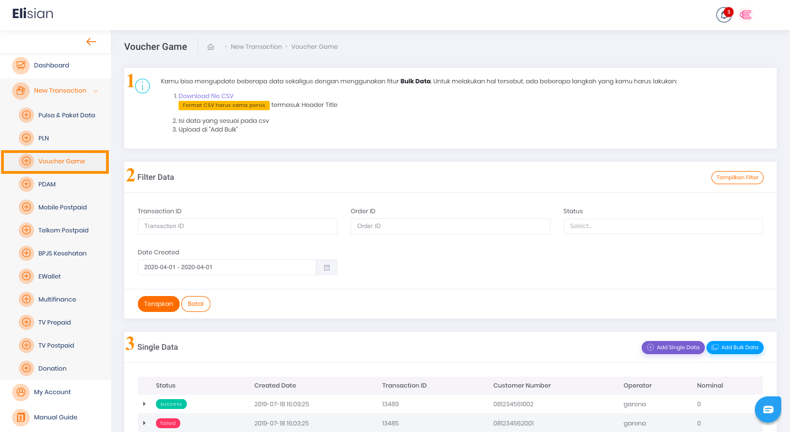
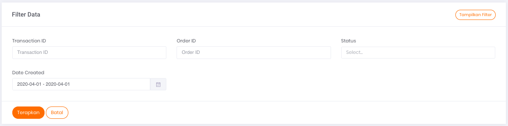
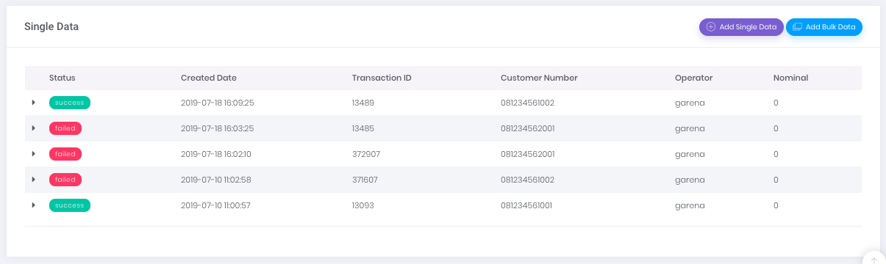

Anda dapat mengakses halaman ini untuk melakukan transaksi pembelian voucher game dengan melalui menu **New Transaction → Voucher Game**

Gambar 1. Tampilan Halaman Transaksi Voucher Game

## **Menu Filter Data**

Pada gambar `Tampilan Halaman Transaksi Voucher Game` di atas terdapat formulir Filter Data (ditandai dengan nomor 2). Untuk detil isi formulir filter, harap mengacu pada gambar di bawah ini:

Gambar 2. Tampilan form filter data

Formulir filter data digunakan untuk menyaring informasi transaksi Voucher Game yang ditampilkan pada tabel daftar riwayat transaksi Voucher Game dengan kriteria tertentu, sesuai dengan isian form filter.

Berikut ini adalah 6 data yang dapat Anda gunakan sebagai parameter untuk mem-filter Transaksi:

1. **Transaction ID**

    Merupakan nomor transaksi

2. **Order ID**

    Merupakan nomor order transaksi yang tercatat pada sistem Anda

3. **Nominal**

    Merupakan jumlah nominal transaksi yang dilakukan

4. **Status**

    Merupakan status dari transaksi yang dilakukan

5. **Operator**
    
    Pilih salah satu operator yang ingin ditampilkan 

6. **Date Created**
    Merupakan tanggal ketika transaksi dilakukan

## **Tabel Daftar Riwayat Transaksi Voucher Game**

Pada gambar `Tampilan Halaman Transaksi Voucher Game` di atas yang ditandai dengan nomor 3 merupakan tabel daftar riwayat transaksi untuk single data. Untuk tampilan lebih jelasnya, harap mengacu pada gambar 3 di bawah ini:

Gambar 3. Tampilan Daftar Riwayat Transaksi Voucher Game

Tabel ini berfungsi untuk menampilkan informasi daftar riwayat transaksi voucher game yang pernah Anda lakukan di Elisian.

## **Informasi Tabel**

Ada 7 informasi yang bisa Anda dapatkan melalui tabel tersebut, yaitu:

1. **Status** 

    Merupakan status transaksi terkait

2. **Created Date** 

    Merupakan tanggal transaksi dibuat (dilakukan)

3. **Transaction ID** 

    Merupakan nomor transaksi yang dilakukan

4. **Customer Number** 

    Merupakan nomor pelanggan yang biasanya diisi nomor telpon pelanggan 

5. **Operator** 

    Merupakan label untuk nama operator yang melakukan transaksi Voucher Game yang dilakukan

6. **Nominal** 

    Merupakan nominal transaksi terkait

## **Tombol Aksi**

Pada Gambar `Tampilan Halaman Transaksi Voucher Game` (poin nomor 3), di bagian kanan, terdapat dua (2) tombol aksi yang berfungsi untuk menjalankan perintah penambahan data. Penambahan data dapat dilakukan secara *bulk* maupun satuan.

[Single Transaction](/Business-Initiatives/BPA#User-Guide-Elisian/elisian-trx-voucher-game-single)

[Bulk Transaction](/Business-Initiatives/BPA#User-Guide-Elisian/elisian-trx-voucher-game-bulk)