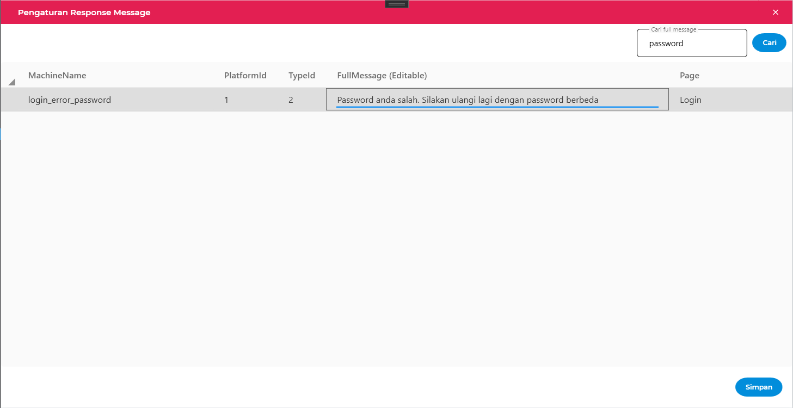

= Penggunaan Response Message via UI Loket.NET

Dokumen ini berisi tentang penggunaan dan pengaturan _response message_ secara UI maupun secara _code_.

== Pengaturan Response Message Pada UI
Halaman pengaturan _response message_ dapat diakses dari halaman _login_ pada _toolbar_ pertama dari kiri.

Anda bisa melakukan pencarian terhadap _message_ yang Anda inginkan.

Kemudian untuk memperbarui _response message_ Anda dapat melakukan klik pada kolom _FullMessage_ dan menggantinya sesuai yang Anda butuhkan.

Setelah itu klik tombol Simpan, dan muncul dialog pemberitahuan bahwa pengaturan _response message_ berhasil.

