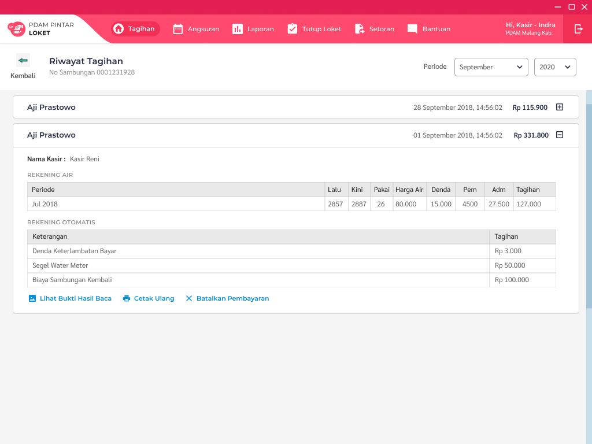

= Flow Tagihan SR Loket.NET

Dokumen ini berisi tentang _flow_ tagihan sr dari sistem Loket.NET.

Berikut adalah _flow_ dari Tagihan Pelanggan SR

== 1. Cari Pelanggan

=== Cari Pelanggan Berdasarkan No Sambungan

Masukan no sambungan dari pelanggan, misalnya 197604361

=== Cari Pelanggan Berdasarkan Nama dan Alamat

Masukkan nama dan alamat untuk memfilter pelanggan.

Pilih pelanggan.

=== Proses 

Pada proses pencarian pelanggan maka akan _query_ dari tabel "pelanggan".

Untuk pencarian berdasarkan no sambungan, sistem akan menggunakan https://github.com/bimasaktialterra/loket.net/blob/PDAM-1695/Apps/Loket.App.Wpf/Commands/Tagihan/PelangganSr/OnSearchSingleCommand.cs[*command ini*]

Untuk pencarian berdasarkan nama alamat menggunakan https://github.com/bimasaktialterra/loket.net/blob/PDAM-1695/Apps/Loket.App.Wpf/Commands/Tagihan/PelangganSr/OnSearchCommand.cs[*command ini*]

Saat *pilih pelanggan* akan mengaktifkan https://github.com/bimasaktialterra/loket.net/blob/PDAM-1695/Apps/Loket.App.Wpf/Commands/Tagihan/PelangganSr/Navigation/OnOpenDetailTagihanCommand.cs[*command ini*] -- proses query akan dijelaskan pada bagian Bayar List Tagihan.

== 2. Bayar List Tagihan

Pilih item mana saja yang akan dibayarkan (dengan check-uncheck pada tabel). Dan isikan nominal bayar.

Klik bayar maka akan muncul pop up seperti ini.

=== Proses

Untuk meng-query item list tagihan menggunakan https://github.com/bimasaktialterra/loket.net/blob/main/Business/Loket.Business.Impl/Services/TagihanService.cs#L422-L454[*code ini*].

Query melibatkan tabel "piutang", "nonair", "biayaotomatis", "param_diskon", "param_denda".

Serta untuk perhitungan denda menggunakan https://github.com/bimasaktialterra/loket.net/blob/main/Business/Loket.Business.Impl/Services/Calculations/TagihanCalculation.cs#L303-L381[*code ini*].

== 3. Riwayat Tagihan

Berikut adalah contoh riwayat tagihan yang memiliki riwayat.

=== Proses

Query melibatkan tabel "bayar".

Dapat dilihat pada https://github.com/bimasaktialterra/loket.net/blob/main/Business/Loket.Business.Impl/Services/TagihanService.cs#L481-L507[*code ini*]
