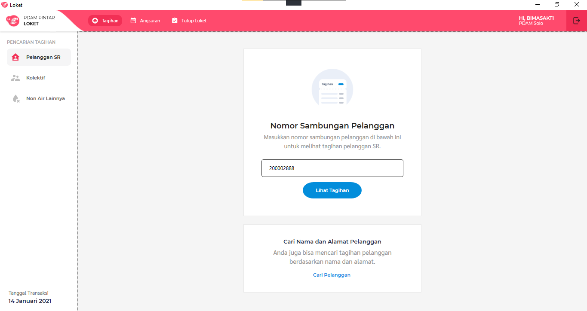
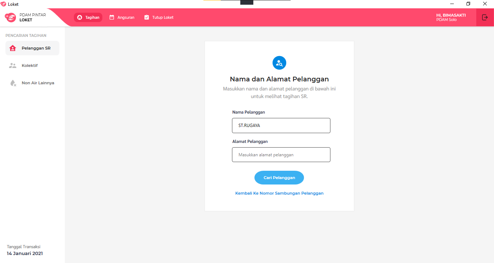
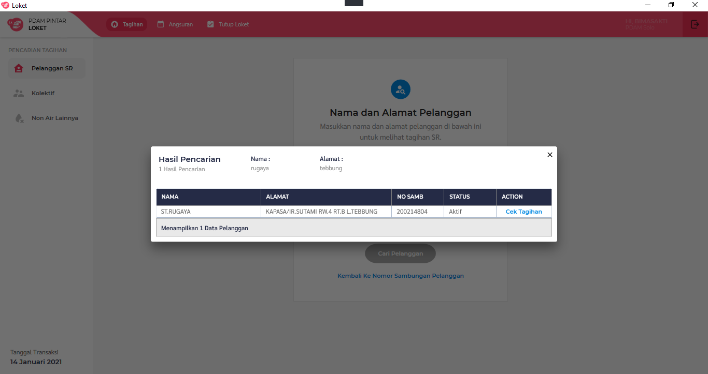
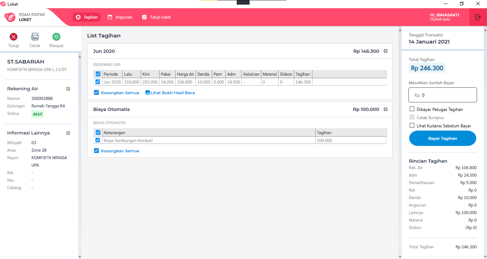
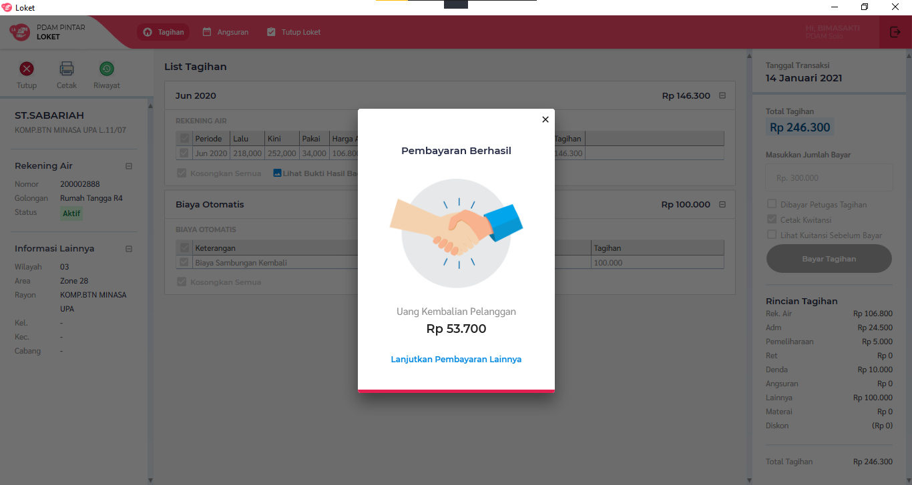

= Flow Pembayaran Tagihan Loket.NET

Dokumen ini berisi tentang _flow_ pembayaran melalui fitur pelanggan sr dari sistem Loket.NET.

Berikut adalah _flow_ dari fitur Pelanggan SR

== 1. Cari Pelanggan

=== Cari Pelanggan Berdasarkan No Sambungan

Masukan no sambungan dari pelanggan pada _textbox_ yang disediakan, disini mengambil contoh "200002888" masukan tanpa tanda ".

=== Cari Pelanggan Berdasarkan Nama dan Alamat

Jika pelanggan tidak membawa kwitansi pembayaran sebelumnya dan tidak ingat nomor sambungannya berapa,
data pelanggan dapat dicari berdasarkan nama dan alamat. Untuk membantu mencari tagihan pelanggan tersebut,
klik "Cari Pelanggan" yang berwarna biru.  

image::./images/pembayaran-tagihan-fitur-pelanggan-sr/04-cek-pelanggan-berdasarkan-nama-atau-alamat.png[900,600]

Setelah diklik, sistem akan menampilkan halaman pencarian tagihan seperti gambar di bawah ini.

Masukan nama atau alamat yang dicari, disini ambil contoh nama "ST.RUGAYA", masukan tanpa tanda ".

Hasil pencarian pelanggan ditampilkan seperti gambar di bawah ini.

=== Proses 

Pada proses pencarian pelanggan maka akan _query_ dari tabel "pelanggan".

Untuk pencarian berdasarkan no sambungan, sistem menggunakan https://github.com/bimasaktialterra/loket.net/blob/PDAM-1695/Apps/Loket.App.Wpf/Commands/Tagihan/PelangganSr/OnSearchSingleCommand.cs[*command ini*]

Untuk pencarian berdasarkan nama alamat, sistem menggunakan https://github.com/bimasaktialterra/loket.net/blob/PDAM-1695/Apps/Loket.App.Wpf/Commands/Tagihan/PelangganSr/OnSearchCommand.cs[*command ini*]

Saat *pilih pelanggan*, sistem akan mengaktifkan https://github.com/bimasaktialterra/loket.net/blob/PDAM-1695/Apps/Loket.App.Wpf/Commands/Tagihan/PelangganSr/Navigation/OnOpenDetailTagihanCommand.cs[*command ini*] -- proses _query_ akan dijelaskan pada bagian Bayar List Tagihan.

== 2. Bayar List Tagihan

Pada list tagihan pilih tagihan mana saja yang akan dibayarkan (dengan check-uncheck pada tabel) disini mengambil contoh "200002888" masukan tanpa tanda ". Dan isikan nominal bayar.

Klik bayar maka akan muncul _pop-up_ seperti ini menandakan transaksi berhasil.

=== Proses

Untuk meng-_query_ proses pembayaran tagihan, sistem menggunakan https://github.com/bimasaktialterra/loket.net/blob/PDAM-1694/Modules/Persistence/Loket.Persistence.MySql/Repositories/TagihanProcedure.cs#L1-L809[*code ini*].

_Query_ proses pembayaran melibatkan tabel :

* Tabel Piutang : Hapus data tagihan yang telah dilunaskan melalui aplikasi.
* Table Bayar : tambah data yang telah lunaskan melalui aplikasi, data didapat dari tabel piutang yang dilunaskan, ada penambahan data pada field-field tertentu:
** _field_ tglbayar : menandakan tanggal berapa tagihan di bayarkan.
** _field_ flaglunas : menandakan status tagihan tersebut lunas atau tidaknya(1 = lunas, 0 = belum lunas). 
** _field_ dendatunggakan : nominal denda yang di kenakan pada rekening.
** _field_ total : nominal rekening air + dendatunggakan.

* Tabel Nonair : memperbarui data tagihan nonair jika berhasil dilunaskan. Pengecualian jika tagihan nonairnya tidak ada pada tabel, contohnya seperti dendatunggakan atau biaya otomatis,
  untuk dendatunggakan datanya dimasukan jika tagihan rekening yang terkena denda itu berhasil di lunaskan. Untuk biaya otomatis nominal biaya didapat dari tabel biaya otomatis,
  data dimasukan setelah pembayaran berhasil.
** _field_ waktubayar : menandakan tanggal berapa tagihan dibayarkan.
** _field_ flaglunas : menandakan status tagihan tersebut lunas atau tidak (1 = lunas, 0 = belum lunas) .
** _field_ total : nominal rekening air + dendatunggakan.
