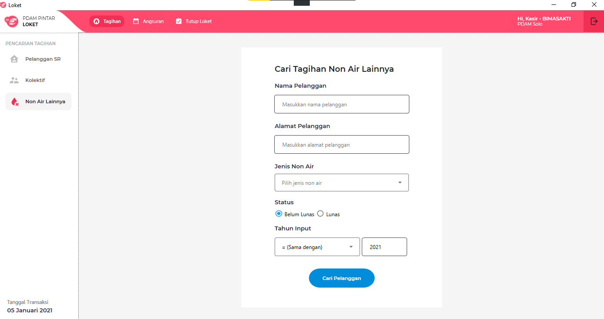
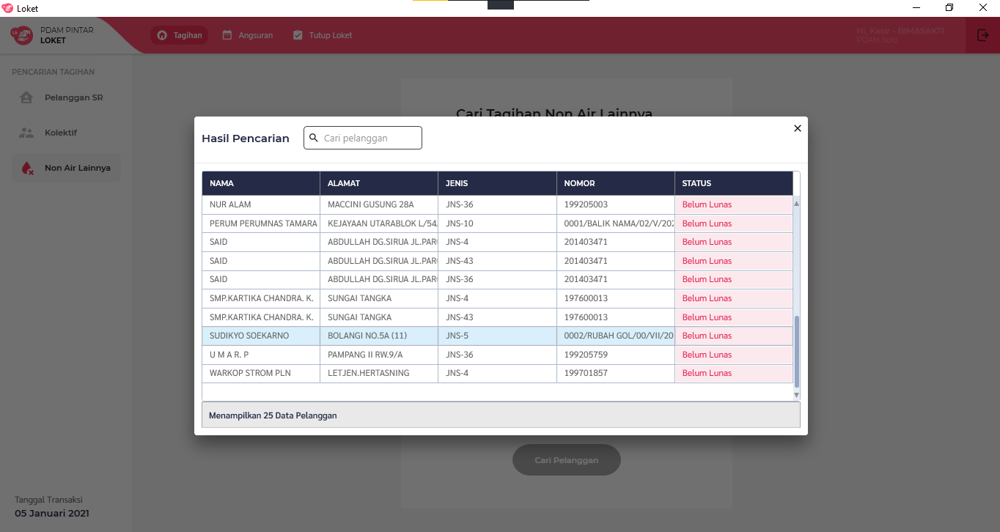
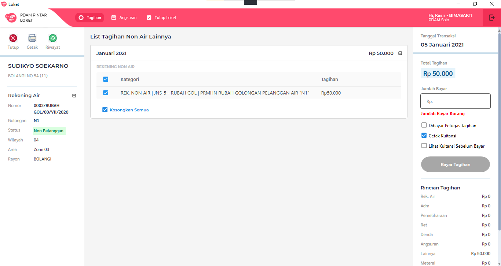
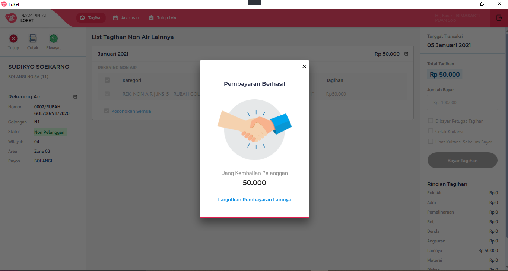
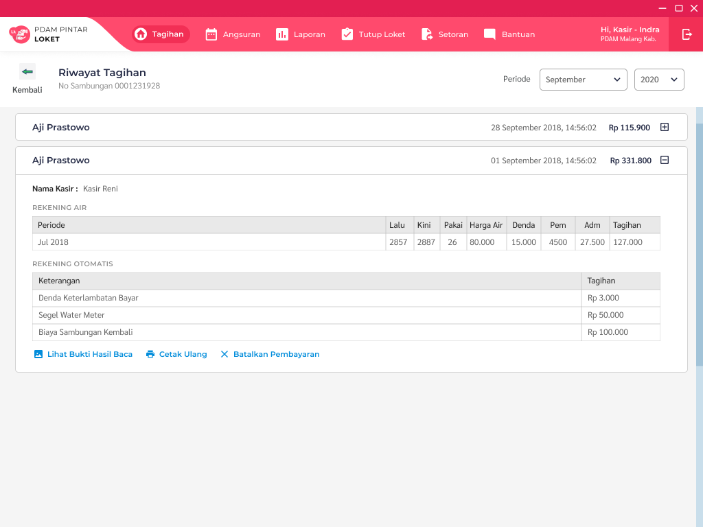

= Flow Tagihan Nonair Loket.NET

Dokumen ini berisi tentang _flow_ tagihan nonair dari sistem Loket.NET.

Berikut adalah _flow_ dari Tagihan Pelanggan Nonair

== 1. Cari Pelanggan

=== Cari Pelanggan Berdasarkan Nama, Alamat, Jenis Nonair, Status Tagihan dan Tahun Input

Masukan nama, alamat, jenis nonair, status tagihan dan tahun input untuk memfilter tagihan nonair yang dicari.
Kolom filter tidak harus diisi semua.

Hasil ditampilkan berdasarkan filter, dari daftar pencarian masih bisa di-filter kembali. 
klik 2x untuk memilih tagihan nonair. 

=== Proses 

Pada proses pencarian pelanggan maka akan _query_ dari tabel "pelanggan".

Untuk pencarian berdasarkan no sambungan, sistem menggunakan https://github.com/bimasaktialterra/loket.net/blob/PDAM-1695/Apps/Loket.App.Wpf/Commands/Tagihan/PelangganSr/OnSearchSingleCommand.cs[*command ini*]

Untuk pencarian berdasarkan nama alamat, sistem menggunakan https://github.com/bimasaktialterra/loket.net/blob/PDAM-1695/Apps/Loket.App.Wpf/Commands/Tagihan/PelangganSr/OnSearchCommand.cs[*command ini*]

Saat *pilih pelanggan* akan mengaktifkan https://github.com/bimasaktialterra/loket.net/blob/PDAM-1695/Apps/Loket.App.Wpf/Commands/Tagihan/PelangganSr/Navigation/OnOpenDetailTagihanCommand.cs[*command ini*] -- proses _query_ akan dijelaskan pada bagian Bayar List Tagihan.

== 2. Bayar List Tagihan

Pilih item mana saja yang akan dibayarkan (dengan _check-uncheck_ pada tabel), kemudian isikan nominal bayar.

Klik bayar maka akan muncul _pop-up_ seperti ini.

=== Proses

Untuk meng-_query_ item list tagihan, sistem menggunakan https://github.com/bimasaktialterra/loket.net/blob/main/Business/Loket.Business.Impl/Services/TagihanService.cs#L422-L454[*code ini*].

_Query_ melibatkan tabel "piutang", "nonair", "biayaotomatis", "param_diskon", "param_denda".

Untuk perhitungan denda, sistem menggunakan https://github.com/bimasaktialterra/loket.net/blob/main/Business/Loket.Business.Impl/Services/Calculations/TagihanCalculation.cs#L303-L381[*code ini*].

== 3. Riwayat Tagihan

Berikut adalah contoh riwayat tagihan yang memiliki riwayat.

=== Proses

_Query_ melibatkan tabel "bayar".

Dapat dilihat pada https://github.com/bimasaktialterra/loket.net/blob/main/Business/Loket.Business.Impl/Services/TagihanService.cs#L481-L507[*code ini*]
