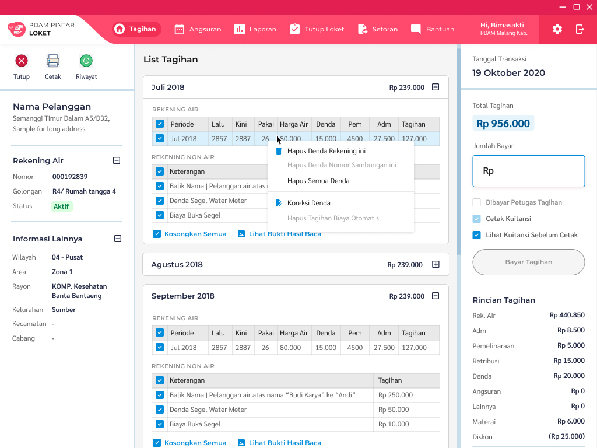
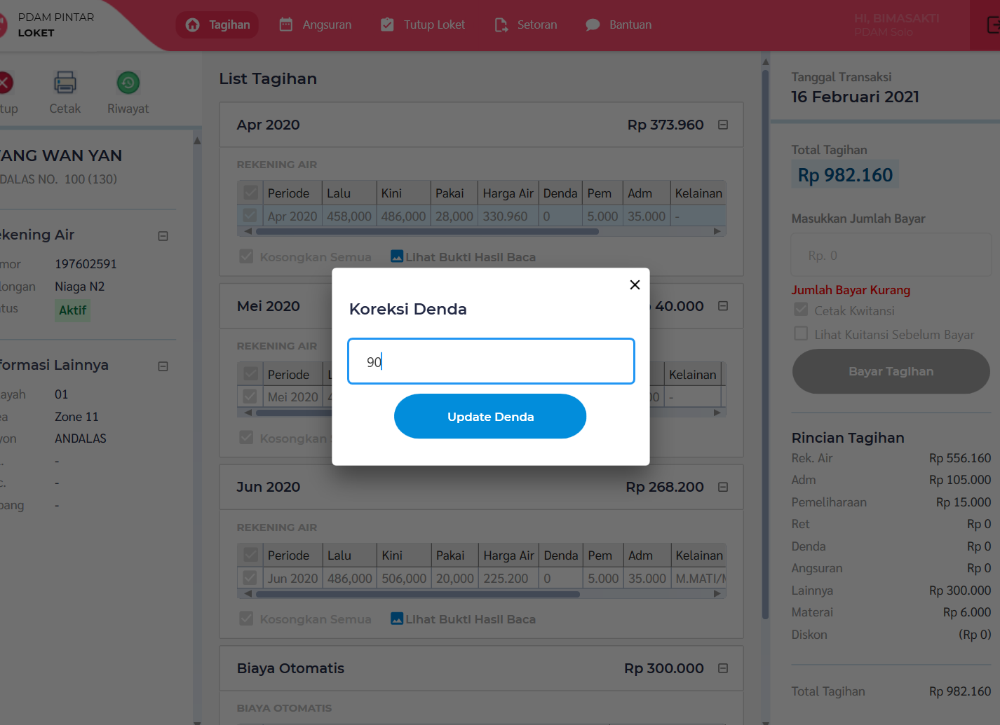
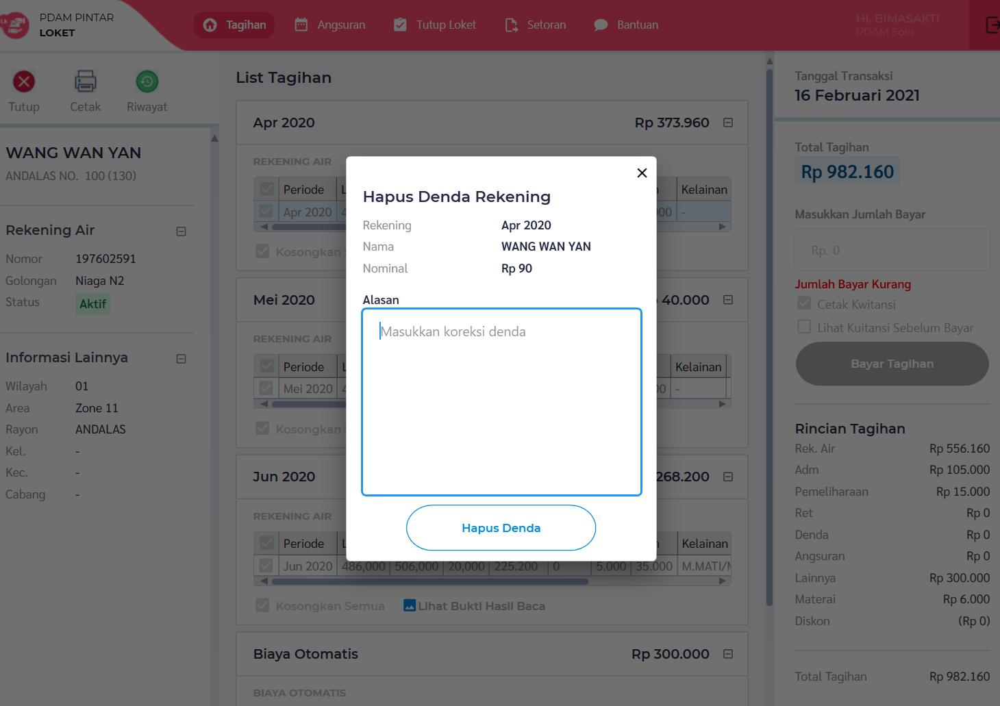
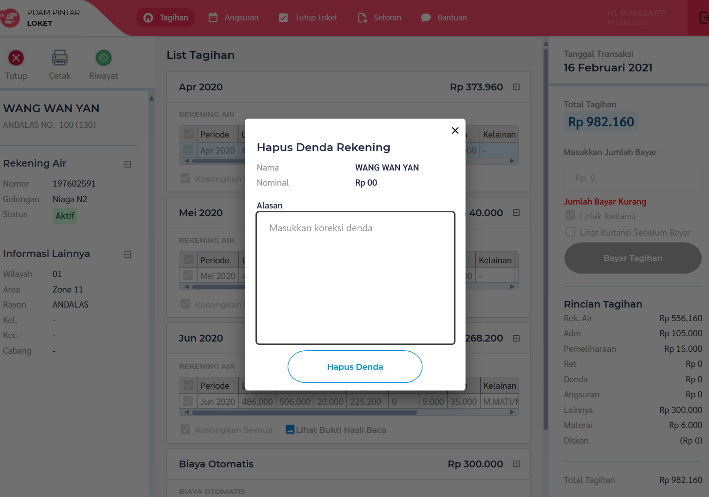
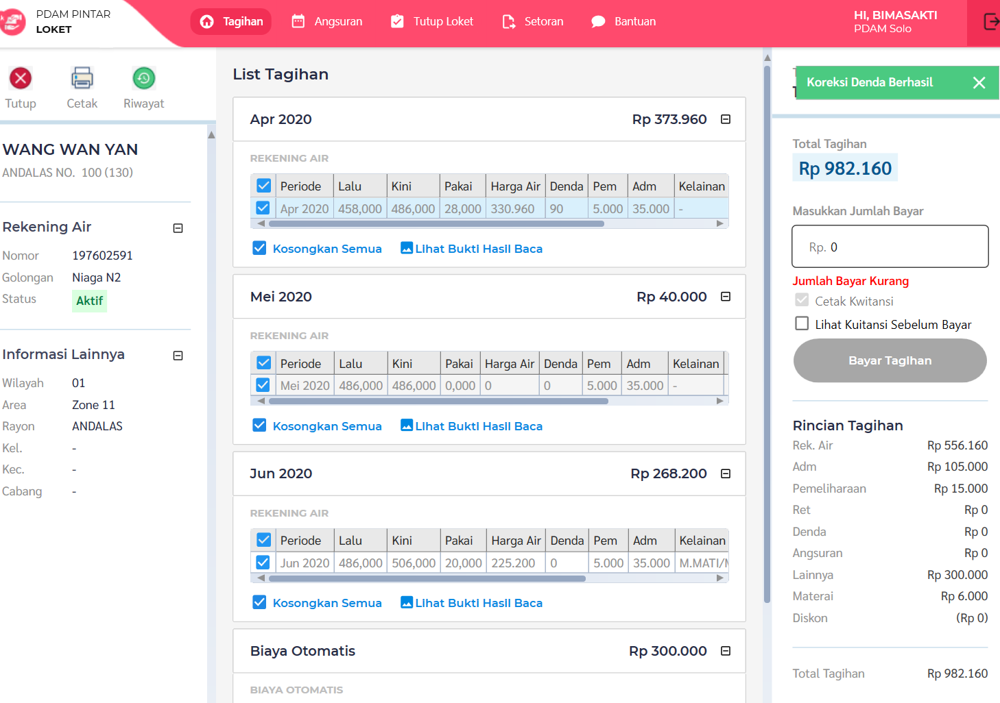
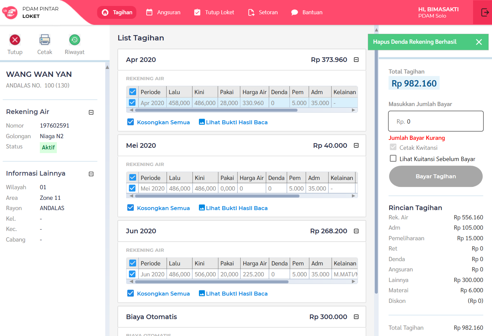

= Koreksi dan Hapus Denda Tagihan SR

Dokumen ini berisi tentang _flow_ koreksi dan hapus denda di tagihan SR dari sistem Loket.NET.

Fitur ini sendiri ada pada page _List Tagihan_.

Berikut adalah _flow_ nya:

=== 1. Klik Kanan Pada Tabel Rekening Air

=== 2. Isi Form Pada Dialog

=== Koreksi Denda

=== Hapus Denda di Satu Rekening

=== Hapus Denda di Semua Rekening

=== 3. Submit Form

=== Koreksi Denda Berhasil

=== Hapus Denda di Satu Rekening Berhasil

== Hapus Denda di Semua Rekening Berhasil
image::./asimagessets/tagihan-pelanggan-sr/Detail_HapusDendaAll_Success.png[900,600]

== Code 

Untuk menampilkan dan menjalankan fitur ini terdapat pada:

1. commands di folder _/Apps/Loket.App.Wpf/Commands/Tagihan/PelangganSr/KoreksiHapusDenda_ 
2. viewmodel di _/Apps/Loket.App.Wpf/ViewModels/Tagihan/TagihanPelangganSrViewModel.cs_
3. view di _/Apps/Loket.App.Wpf/Views/Component/Tagihan/Dialog_ dan _/Apps/Loket.App.Wpf/Views/Component/Tagihan/PelangganSr_

== Database

Untuk menjalankan fitur ini butuh tabel _userbolehhapusdenda_ untuk permission usernya serta _hapusdenda_ untuk mencatat log hapus dendanya.

== Special Notes

Pada fitur ini ada beberapa case binding dan resourcedictionary yang tidak biasa dikarenakan _nested binding_.
Untuk casenya bisa dilihat pada component _x:Name="DataGridRekeningAir"_ di file ListTagihanView.xaml.

Untuk binding tersebut dapat di solve dengan property Tag di DataGrid yang binding ke UserControl, sehingga ContextMenu nya binding ke Tag tersebut. Hal tersebut dikarenakan ContextMenu tidak ada pada tree component (pohon component).

Untuk resource dictionary nya di initiate ulang di Resource karena kondisi nested yang tidak dapat mendeteksi ResourceDictionary pada parent (UserControl).
