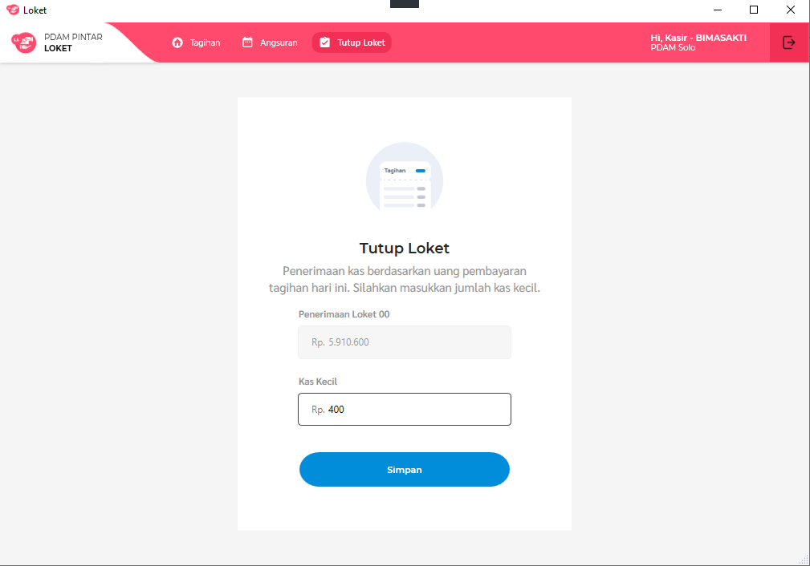
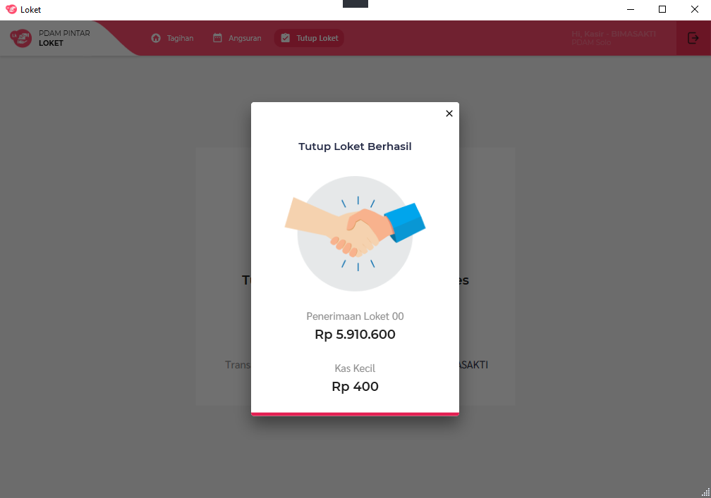
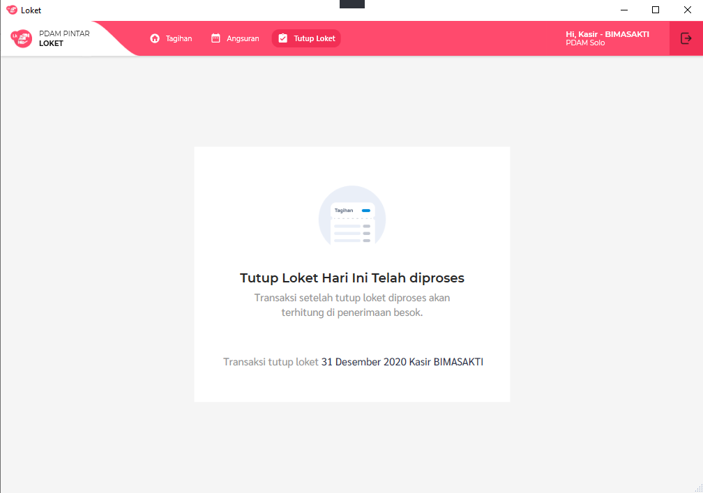

= Flow Tutup Loket.NET

Dokumen ini berisi tentang _flow_ tutup loket dari sistem Loket.NET.

Berikut adalah _flow_ dari Tutup Loket

== 1. Proses Tutup Loket

=== Proses Melakukan Tutup Loket 

Proses tutup loket dilakukan ketika kasir hendak menyetorkan uang ke bank. 
Nominal yang tertera pada sistem harus sama dengan uang diterima, jika uang yang diterima lebih,
inputkan pada kolom kas kecil.

=== Proses 

Pada proses tutup loket, melakukan _query_ ke tabel "bayar, nonair, bayarlltt, bayarlimbah".

Untuk Menghitung nominal penerimaan yang dilunaskan berdasarkan loketbayar, sistem akan menggunakan https://github.com/bimasaktialterra/loket.net/blob/main/Apps/Loket.App.Wpf/Commands/TutupLoket/OnLoadTutupLoketCommand.cs[*command ini*]

== 2. Tutup Loket Berhasil

=== Konfirmasi Tutup Loket Berhasil 

Konfirmasi tutup loket menandakan bahwa data tutup loket berhasil disimpan.

=== Tutup Loket Berhasil Dilakukan
Jika tutup Loket berhasil disimpan, maka tampilan pada fitur tutup loket akan berubah seperti gambar di bawah ini:

=== Proses

_Query_ melibatkan tabel "tutuploket,nonair".

Dapat dilihat pada https://github.com/bimasaktialterra/loket.net/blob/main/Apps/Loket.App.Wpf/Commands/TutupLoket/OnSaveTutupLoketCommand.cs[*code ini*]
