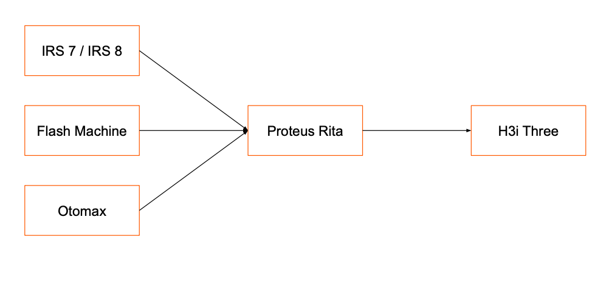

= Proteus Rita
:keywords: gst, traditional

== Overview

Proteus Rita adalah aplikasi yang menggantikan IRS Rita.
Berfungsi untuk membantu menyambungkan ke _authorize distributor_ resmi tiga _provider_.
Proteus Rita dibuat karena IRS Rita _price_ adalah 8 juta untuk setiap _cluster_ yang dimiliki.

== Team Involved

|===
| *Name* | *Role* | *Email*

| Kevin Setiawan Tanzil
| Lead Software Engineer
| kevin@alterra.id

| Evan Sujanto
| Development Manager
| evan@alterra.id

| Anandhi Tristiaratri
| Quality Engineer
| anandhi@alterra.id

| Moehammad Oki Putra Samudra
| Software Engineer
| oki@alterra.id

| Doni Hadiyansyah
| Software Engineer
| dhadiansyah@alterra.id
|===

== Technical Information

<<docs/technology-proteus-rita.adoc#, Technology Proteus Rita>>

== Onboarding Information

<<docs/dev-onboarding-proteus-rita.adoc#, Developer Onboarding Proteus Rita>>

<<docs/development-proteus-rita.adoc#, Development Proteus Rita>>

== Documentation

<<docs/api-doc-proteus-rita.adoc#, API Documentation Proteus Rita>>

<<docs/adr-doc-proteus rita.adoc#, ADR Document Proteus Rita>>

<<docs/product-information-proteus-rita.adoc#, Product Information Document Proteus Rita>>